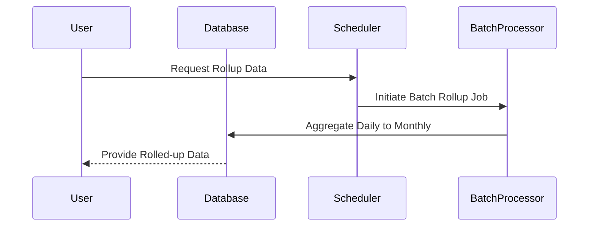

## Temporal Rollups

### Description

The Temporal Rollups design pattern involves aggregating data across different time intervals, allowing systems to efficiently compute higher-level summaries from more granular datasets. This pattern is particularly useful in time series databases, analysis systems, and reporting tools, where insights are often derived from summarized data at varying time intervals. It helps in reducing query complexity and improving performance.

### Architectural Approach

Temporal aggregation is typically implemented at two levels:

1. **Batch Processing**: Involves periodically computing and storing the aggregate values for higher time intervals using scheduled jobs. This might use technologies such as Apache Spark, Flink, or traditional ETL pipelines. The results are then stored in a database optimized for time-series data, like Apache Cassandra or InfluxDB.

2. **On-the-Fly Aggregation**: Involves computing aggregates on-demand when a query is executed. While this approach can be flexible, it can be resource-intensive for large datasets unless properly optimized.

### Best Practices

- **Incremental Rollup**: Periodically update only the new changes rather than recalculating everything from scratch. This can significantly reduce processing time and resource consumption.
  
- **Data Partitioning**: Use time-based partitioning to facilitate easier rollup operations and improve I/O performance.
  
- **Pre-Aggregation**: Strategically pre-compute rollups during off-peak hours for time intervals that are frequently queried.
  
- **Storage Optimization**: Use columnar storage formats (like Parquet or ORC) for efficient compression and fast retrieval of aggregated data.

### Example Code

Using SQL for batch processing of temporal rollups:

```sql
INSERT INTO monthly_production
SELECT 
    DATE_TRUNC('month', production_date) AS month,
    SUM(volume) AS total_volume
FROM 
    daily_production
GROUP BY 
    DATE_TRUNC('month', production_date);
```

This SQL snippet calculates monthly production totals from daily data, which is illustrative of a batch processing approach.

### Related Patterns

- **Materialized View**: Creating materialized views that automatically manage the rollup of temporal data.
- **Lambda Architecture**: Combining batch processing with real-time systems for dealing precisely with time-bound data patterns.

### Diagrams

#### Sequence Diagram



### Additional Resources

- "Designing Data-Intensive Applications" by Martin Kleppmann – provides a deep dive into data modeling patterns and infrastructure.
- The Apache Flink Documentation – details on how to implement time-based aggregations in a stream processing context.

### Summary

The Temporal Rollups pattern is instrumental in efficiently managing and querying time-series data by providing mechanisms to aggregate finer-grained temporal data into broader time intervals. By optimizing storage and computation, systems benefit from rapid and scalable access to summarized insights, crucial for decision-making in domains such as IoT analytics, financial markets, and operational metrics.
