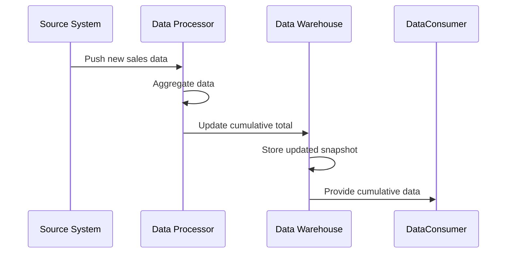

## Accumulating Snapshots

### Description

Accumulating Snapshots is a design pattern used in data modeling that involves aggregating data over time to calculate cumulative totals. This pattern is crucial for scenarios where ongoing accumulation of data provides more insight than static, point-in-time data. A common example of this pattern is tracking cumulative sales to date for an entire fiscal year, where each update aggregates new sales data into the existing totals.

### Key Concepts

- **Temporal Aggregation**: Combines multiple data points over time to form a single point of insight, often progressive.
- **Cumulative Aggregation**: Progressive accumulation of data, such as ongoing sales totals.
- **Snapshot Fact Table**: A common implementation where facts are recorded at specific intervals to capture changes over time.

### Architectural Approach

1. **Data Capture and Storage**: Organize raw data into records, ensuring that each record can be linked temporally to allow for accumulations over time.
   
2. **Aggregations and Updates**: Use a mechanism to continually update the cumulative totals as new data comes in. This typically involves:

   - **Extracting** data from different sources.
   - **Transforming** and aggregating the data to calculate cumulative totals.
   - **Loading** results back into a data store optimized for querying, often a data warehouse.

3. **Support for Updates**: Allow records to be revisited and updated whenever new data is available.

### Example Code

Here’s a basic example using SQL to keep a running total of sales in a sales table:

```sql
WITH DailySales AS (
  SELECT
    sales_date,
    SUM(sales_amount) AS daily_sales
  FROM
    sales
  GROUP BY
    sales_date
),
AccumulatedSales AS (
  SELECT
    sales_date,
    daily_sales,
    SUM(daily_sales) OVER (ORDER BY sales_date) AS cumulative_sales
  FROM
    DailySales
)
SELECT
  sales_date,
  cumulative_sales
FROM
  AccumulatedSales;
```

### Diagram

Here's a UML Sequence diagram illustrating the data flow in an Accumulating Snapshots pattern:



### Related Patterns

- **Event Sourcing**: Involves storing changes as a sequence of events, directly impacting how snapshots accumulate over time.
- **Slowly Changing Dimension (SCD)**: Manages and captures changes in data over time but focuses more on dimension changes rather than fact accumulation.
- **Data Vault**: Represents an enterprise data warehouse model that offers flexibility around updating information and is often used in conjunction with snapshot mechanisms.

### Additional Resources

- [Data Warehousing Fundamentals for IT Professionals](https://www.wiley.com/en-us/Data+Warehousing+Fundamentals+for+IT+Professionals,+2nd+Edition-p-9780470526828)
- [The Data Warehouse Lifecycle Toolkit](https://www.wiley.com/en-us/The+Data+Warehouse+Lifecycle+Toolkit:+Expert+Methods+for+Designing+Developers+and+Others,+Third+Edition-p-9781119728515)

### Summary

The Accumulating Snapshots pattern is essential for scenarios requiring progressive data accumulation and analysis. By continually updating cumulative totals from temporal data, organizations can obtain detailed insights over time, which is particularly useful in areas like finance and retail where total performance metrics are crucial. This pattern complements other data management approaches, delivering a dynamic and informative view of business operations.
