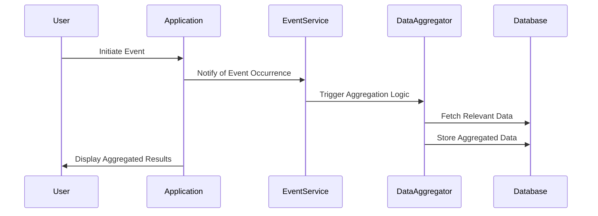

## Event-Based Aggregation

Event-Based Aggregation is a data modeling design pattern that involves aggregating data based on the occurrence of specific events or conditions over time. This approach is particularly useful in scenarios where information needs to be summarized or analyzed in the context of notable occurrences, such as promotional periods, events of product launches, or seasonal shifts.

### Explanation

In many business scenarios, data is not simply a continuous flow needing standard aggregation, but rather, must be viewed in light of determined events or conditions. The Event-Based Aggregation pattern allows developers to focus on aggregating data within these bounding events, providing insights that are temporally relevant to user-defined conditions.

The key to Event-Based Aggregation is accurately defining the start and end points of an event, enabling accurate and useful data summaries. For instance, aggregating transaction data occurring within promotional periods can help understand the financial impact of these periods.

### Architectural Approach

Event-Based Aggregation typically involves:

- **Event Identification**: Clearly defining the events or triggers of interest.
- **Temporal Boundaries**: Establishing temporal windows relevant to the events.
- **Aggregation Logic**: Designating the operations (e.g., summing, averaging) to apply on the data within the context of these events.
- **Stream/Batch Processing**: Depending on the real-time requirements, this could be implemented via streaming platforms like Apache Kafka with Stream Processing through Kafka Streams or Apache Flink.

### Example Code

An example using Apache Kafka Streams in Scala to aggregate sales during promotional events:

```scala
import org.apache.kafka.streams.scala.StreamsBuilder
import org.apache.kafka.streams.scala.kstream._
import org.apache.kafka.streams.scala.Serdes._
import org.apache.kafka.streams.KafkaStreams
import org.apache.kafka.streams.StreamsConfig

import java.util.Properties

object EventBasedAggregationExample extends App {

  val props: Properties = {
    val p = new Properties()
    p.put(StreamsConfig.APPLICATION_ID_CONFIG, "event-based-aggregation")
    p.put(StreamsConfig.BOOTSTRAP_SERVERS_CONFIG, "localhost:9092")
    p
  }

  val builder = new StreamsBuilder
  val transactionsStream: KStream[String, Double] = builder.stream[String, Double]("transactions")
  
  // Define a filter for promotional periods
  val promotionalTransactions = transactionsStream.filter { (key, value) =>
    // Example condition to identify a promotional event
    key.contains("promo")
  }
  
  // Perform aggregation on the filtered stream
  val aggregatedSales = 
    promotionalTransactions.groupByKey.aggregate(0.0)(_ + _)

  val aggregatedTable: KTable[String, Double] = aggregatedSales.toStream.to("aggregated-sales")

  val streams: KafkaStreams = new KafkaStreams(builder.build(), props)
  streams.start()

  sys.ShutdownHookThread {
    streams.close()
  }
}
```

### Mermaid UML Sequence Diagram



### Related Patterns

- **Time-Windowed Aggregation**: Employs a more general temporal approach by using windows specified by length or sliding windows without dependency on specific events.
- **Event-Driven Data Pipeline**: Structures the flow of data processing in response to events within a system.
- **Change Data Capture**: Uses logs to capture changes for determining the events leading to system updates.

### Additional Resources

- [Kafka Streams Documentation](https://kafka.apache.org/documentation/streams/)
- [Designing Data-Intensive Applications by Martin Kleppmann](https://dataintensive.net/)

### Summary

Event-Based Aggregation helps to condense and contextualize data vis-à-vis significant events. This design pattern is crucial in delivering dynamic and timely data insights enabling data stakeholders to make event-driven decisions. By leveraging tools like Apache Kafka Streams, modern data platforms can efficiently implement this aggregation strategy in both real-time and batch processing environments.
