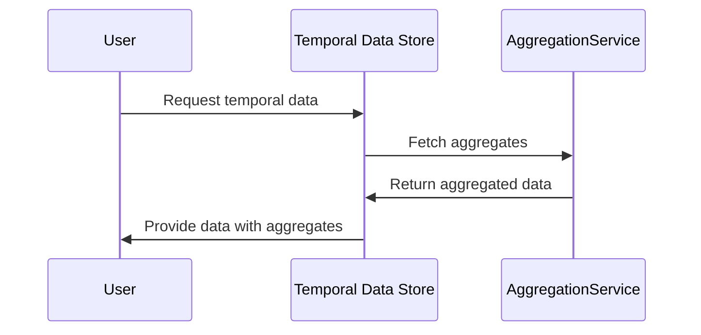

## Introduction

Temporal Joins with Aggregation is a powerful design pattern used to enhance insights from data by combining temporal data with aggregates. This pattern is particularly beneficial in data analytics, time-series analysis, and time-based data monitoring applications. By merging time-bound data with aggregated stats (such as averages, sums, counts, etc.), businesses gain a deeper understanding of temporal dependencies and trends.

## Architectural Approaches

1. **Data Warehouse with Temporal Layering**: Store raw temporal data and computed aggregates separately in a data warehouse. Utilize SQL to create views for performing temporal joins with aggregates in analytics queries.

2. **Streaming Data Pipelines**: Use stream processing frameworks like Apache Kafka and Apache Flink to compute aggregates on-the-fly and apply temporal joins in real-time, allowing prompt insights and actions.

3. **Hybrid Data Platforms**: Combine batch processing engines (e.g., Apache Spark) with real-time streaming systems to periodically compute aggregates and provide temporal joins for hybrid analytical queries.

## Design Pattern Components

- **Temporal Data Sources**: Entities like customer orders with associated intervals represent temporal spans of interest.
  
- **Aggregate Functions**: Such as `AVG`, `SUM`, or `COUNT` applied over a temporal data range to summarize data.

- **Temporal Joins**: Join operations that intersect temporal intervals, aligning events or entities based on temporal constraints.

## Best Practices

- **Correct Time Interval Modeling**: Ensure that time intervals in your schema capture the necessary granularity to avoid misalignments or data skewing.

- **Efficient Indexing and Partitioning**: Leverage indexes on time attributes and partition large datasets to optimize query performance.

- **Latency Considerations**: When using streaming systems, account for processing and event-time latency, especially in distributed environments.

- **Use of Window Functions**: Consider using SQL window functions to handle complex temporal aggregations over sliding and tumbling windows effectively.

## Example Code

### SQL Approach

```sql
WITH OrderAggregates AS (
  SELECT customer_id, AVG(order_value) as avg_order_value, order_date
  FROM Orders
  GROUP BY customer_id, order_date
)
SELECT c.customer_id, c.order_id, o.avg_order_value
FROM CustomerOrders AS c
JOIN OrderAggregates AS o
ON c.customer_id = o.customer_id AND
   c.order_date BETWEEN o.order_date AND o.order_date + INTERVAL '1 DAY'
```

### Apache Flink Approach

```java
DataStream<Order> orders = ...
DataStream<OrderAggregate> orderAggregates = ...

orders.keyBy(Order::getCustomerId)
      .intervalJoin(orderAggregates.keyBy(OrderAggregate::getCustomerId))
      .between(Time.days(-1), Time.days(0))
      .process(new ProcessJoinFunction<Order, OrderAggregate, Result>() {
          @Override
          public void processElement(Order left, OrderAggregate right, Context ctx, Collector<Result> out) {
              // Business logic for joining and aggregating
          }
      });
```

## Diagram



## Related Patterns

- **Time Series Data Pattern**: Handling series of data points indexed in time order.
- **Event Sourcing**: Capturing a series of event states for temporal retracing of changes.
- **CQRS**: Segregates read and update operations for improving database scalability.

## Additional Resources

- [Designing Data-Intensive Applications by Martin Kleppmann](https://dataintensive.net/)
- [Streaming Systems by Tyler Akidau et al.](https://www.oreilly.com/library/view/streaming-systems/9781491983874/)

## Summary

Temporal Joins with Aggregation complements temporal data analytics by enhancing temporal correlations with meaningful aggregates. By understanding the intricacies of time-based data architecture, businesses can make informed insights and adapt to changes observed in temporal patterns. Whether leveraging batch processing, real-time streaming, or a hybrid model, the guideline remains the same: treat time as a first-class citizen in your data architecture.
