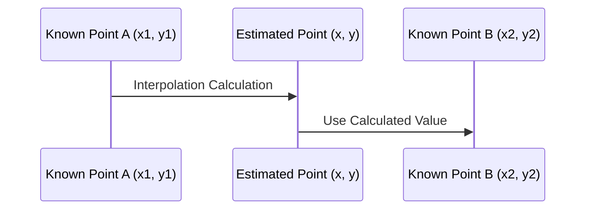

## Introduction

The **Gap Filling and Interpolation** design pattern addresses the challenge of handling missing temporal data in datasets. In scenarios where continuous data collection is required, such as in IoT, telemetry, or financial data, missing data points are inevitable. To ensure accurate data aggregation, it is crucial to estimate these missing values logically.

## Description

Gap filling involves identifying and estimating missing data within a temporal sequence. Interpolation, a crucial component of gap filling, is used to estimate these missing values based on available data. This approach is essential for accurate temporal aggregation and analysis. By employing interpolation methods, such values can be reconstructed, making it possible to derive reliable insights and calculations, such as average daily temperature or total hourly energy consumption.

## Typical Use Cases

- **Environmental Monitoring**: Estimating missing temperature or humidity readings.
- **Financial Analytics**: Filling missing stock price data to facilitate trend analysis.
- **IoT Devices**: Performing calculations based on continuous data streams from sensors.
  
## Interpolation Methods

Different interpolation methods serve distinct purposes based on the nature of the data and application needs. Common interpolation methods include:

1. **Linear Interpolation**: Assumes a linear change between two known points. Ideal for datasets where changes are consistent over time.
   
   Example:
   ```javascript
   function linearInterpolation(x1, y1, x2, y2, x) {
       return y1 + ((x - x1) * (y2 - y1)) / (x2 - x1);
   }
   const estimatedValue = linearInterpolation(1, 10, 3, 30, 2); // Output: 20
   ```

2. **Polynomial Interpolation**: Fits a polynomial curve through known data points, useful when data represent a smooth yet nonlinear distribution.

3. **Spline Interpolation**: Reconstructs missing data using piecewise polynomials for a smoother fit over large datasets.

4. **Kriging**: Utilizes spatial correlations to interpolate data, effective in geostatistical applications.

## Diagram

Below is a simple linear interpolation example shown with a sequence of missing data points:



## Related Patterns

- **Data Imputation**: Broader technique focusing on filling missing values beyond temporal series.
- **Data Smoothing**: Techniques like moving averages that address noise in data, closely related to handling missing values.

## Additional Resources

- [Interpolation Methods Overview](https://en.wikipedia.org/wiki/Interpolation)
- [Data Science for Business Using R](https://www.springer.com/gp/book/9783030049186), touches on data interpolation techniques.

## Summary

The **Gap Filling and Interpolation** pattern offers a robust solution for maintaining data integrity in the presence of missing temporal elements. Through various interpolation techniques, businesses and analysts can derive accurate insights, promoting informed decision-making within diverse domains. Using this pattern allows continuity and reliability in data-driven applications, strengthening both predictive and real-time analytics. Applying these principles, organizations can effectively manage incomplete datasets without compromising on quality and precision.
