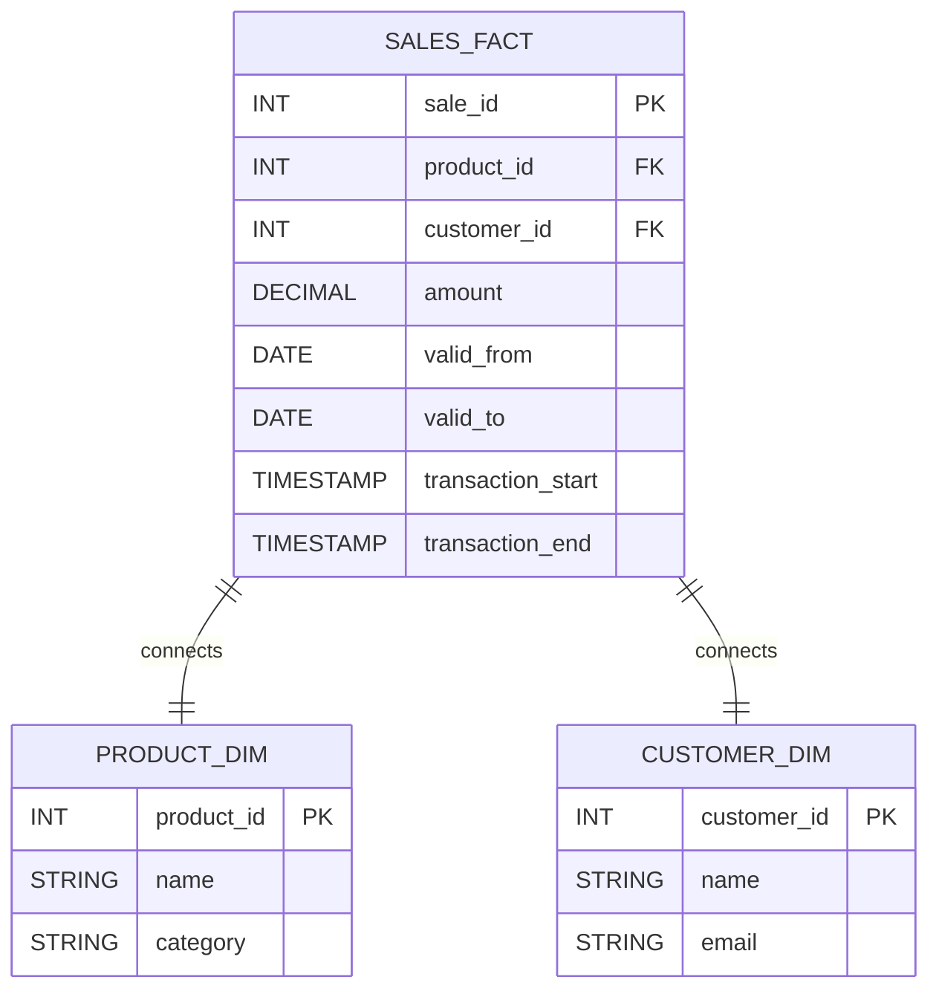

## Introduction

In data warehousing, temporal data management is crucial for capturing the time-sensitive aspects of data. The Bi-Temporal Star Schema design pattern is a sophisticated approach that integrates time-based data effectively into star schema data models. This enables businesses to query data history and corrections over time comprehensively. The design leverages two types of temporal dimensions – the valid time and the transaction time – to enrich analytics capabilities.

## Understanding Bi-Temporal Star Schema

### Bi-Temporal Concepts

1. **Valid Time**: Represents the period during which data is considered accurate concerning the real-world events. For instance, the time range when a sales transaction price was effective.

2. **Transaction Time**: Represents the period during which the record is stored in the database system, capturing data corrections or updates over time.

### Architectural Approach

In a classic star schema, a central fact table is connected to multiple dimension tables. Incorporating bi-temporal data involves:

- **Fact Tables**: Transform your central fact table to include four temporal columns:
  - `ValidFrom`: When the data is applicable in the real world.
  - `ValidTo`: When the data stops being applicable.
  - `TransactionStart`: When the data entered the database.
  - `TransactionEnd`: When the data was removed or superseded.
  
- **Temporal Dimensions**: Dimension tables should include temporal aspects, providing context for the facts connected to real-world semantics and auditing purposes.

### Best Practices

- Ensure temporal consistency by validating overlaps and gaps in the timestamp ranges.
- Use database features like temporal tables if supported (e.g., ANSI SQL, SQL Server Temporal Tables, etc.) to simplify implementation.
- Maintain historical accuracy while minimizing performance overhead by indexing temporal columns effectively.

## Example Code

Below is an example SQL table structure for a sales fact table incorporating bi-temporal data:

```sql
CREATE TABLE sales_fact (
    sale_id INT PRIMARY KEY,
    product_id INT,
    customer_id INT,
    amount DECIMAL(10,2),
    valid_from DATE,
    valid_to DATE,
    transaction_start TIMESTAMP,
    transaction_end TIMESTAMP,
    FOREIGN KEY (product_id) REFERENCES product_dim(product_id),
    FOREIGN KEY (customer_id) REFERENCES customer_dim(customer_id)
);

CREATE INDEX idx_valid_time ON sales_fact (valid_from, valid_to);
CREATE INDEX idx_transaction_time ON sales_fact (transaction_start, transaction_end);
```

## Diagrams

Below is a Mermaid diagram illustrating the bi-temporal star schema:



## Related Patterns

- **Slowly Changing Dimensions (SCD)**: A method for managing attributes that change over time.
- **Temporal Data Pattern**: Broader strategies for accommodating time-variant data within databases.

## Additional Resources

- [Time-Oriented Data in Relational Databases](https://en.wikipedia.org/wiki/Temporal_database)
- [Designing Bitemporal Databases: Introducing System-Time and Application-Time](https://www.amazon.com/Designing-Bitemporal-Databases-System-Time-Application-Time/dp/1634621225)

## Summary

The Bi-Temporal Star Schema pattern enhances the conventional star schema by embedding both the valid and transaction time attributes into fact and dimension tables. This allows businesses to conduct detailed temporal analyses, including the ability to audit historical data changes and corrections. Following best practices such as consistent time management and optimized querying can maximize the benefits of this advanced data modeling technique.
