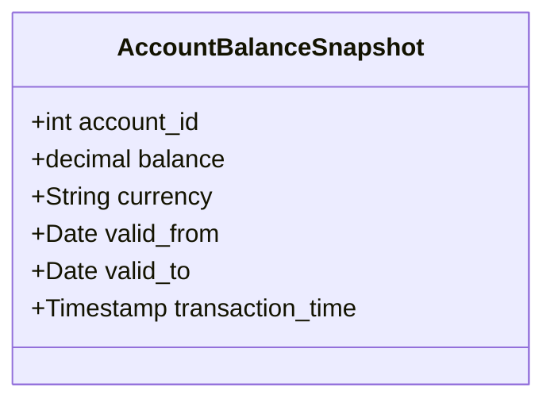

## Introduction

The Temporal Snapshot Fact Table design pattern is essential for scenarios where there's a need to track historical facts over time in both transactional and valid-time dimensions. This pattern involves capturing and storing the state of data at regular intervals, which is particularly useful for auditing, regulatory requirements, and time-based analysis.

## Detailed Explanation

### Key Concepts

1. **Snapshot**: A record of the data state at a particular point in time. Snapshots are typically taken at regular intervals (e.g., daily, weekly).
2. **Fact Table**: In data warehousing, a fact table stores quantitative data for analysis and is made up of measurements, metrics, or facts of a business process.
3. **Bi-Temporal Data**: Captures both the valid-time when the fact is true in the domain and the transaction-time when the fact is stored in the database.
4. **Temporal Validity**: Involves two key time dimensions:
   - **Valid Time**: The time period during which a data fact is correct in the real world.
   - **Transaction Time**: The time period during which a data fact is stored in the database system.

### Architecture and Structure

Here's a generic structure of a Temporal Snapshot Fact Table capturing account balances:

```sql
CREATE TABLE AccountBalanceSnapshot (
    account_id INT,
    balance DECIMAL(15, 2),
    currency VARCHAR(10),
    valid_from DATE,
    valid_to DATE,
    transaction_time TIMESTAMP DEFAULT CURRENT_TIMESTAMP,
    PRIMARY KEY (account_id, valid_from, transaction_time)
);
```

### Example Use Case

For a financial institution needing daily balance records to audit historical account statement transactions:

- **Valid Time**: When the account balance was actually true.
- **Transaction Time**: When the balance record was entered into the data warehouse.

Each snapshot in the table represents the balance for an account at the end of each day. This way, you can query the balances as of any day.

## Best Practices

- Regularly schedule snapshots to keep temporal data up to date and ensure data consistency.
- Utilize indices on temporal columns (`valid_from`, `valid_to`, `transaction_time`) to speed up queries that filter on these dimensions.
- Store only the necessary temporal snapshots to minimize storage and enhance performance.
- Implement data archiving and purging strategies to manage data growth.

## Diagrams

Here's a simple class diagram representing the Temporal Snapshot Fact Table concept:



## Related Patterns

- **Slowly Changing Dimensions (SCD)**: Deals with scenarios where dimensions change over time.
- **Event Sourcing**: Instead of storing the current state, store all changes as events.
- **Change Data Capture (CDC)**: Techniques to capture changes for use in data pipelines.

## Additional Resources

- Kimball, Ralph. "The Data Warehouse Toolkit: The Definitive Guide to Dimensional Modeling."
- Inmon, Bill. "Building the Data Warehouse."

## Summary

Temporal Snapshot Fact Tables are crucial for maintaining a history of fact data for analysis with temporal aspects. Implementing this pattern enables detailed and accurate reporting over time, accommodating the needs of various business processes that rely on up-to-date temporal data integrity. Understanding bi-temporal data management is essential as businesses require more complex time-related inquiries and reporting standards evolve to become stricter.
