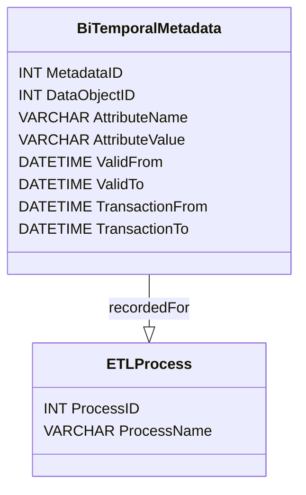

## Overview

In the realm of cloud computing and data warehousing, **Bi-Temporal Metadata Management** is a critical design pattern that involves tracking and managing metadata with two separate dimensions of time: the valid time and the transaction time. This approach is essential for maintaining data lineage and ensuring robust data provenance, particularly in environments characterized by dynamic and complex data extraction, transformation, and loading (ETL) processes.

## Problem Statement

As data systems grow more intricate, the need to track metadata changes over time and reconstruct historical states becomes crucial. Traditional metadata management systems often lack the capability to represent changes effectively across both the valid timeline (actual real-world change) and the transaction timeline (the change as recorded in the database). This inadequacy can lead to issues in data lineage, inconsistent historical views, and auditing challenges.

## Solution

Bi-Temporal Metadata Management addresses these challenges by maintaining metadata across two dimensions of time:

- **Valid Time**: The time period during which the data is considered valid in the real world.
- **Transaction Time**: The time period during which the data is stored in the system.

By separating these two timelines, you can efficiently track when data should have changed versus when it actually did, allowing for meticulous data backups, thorough auditing, and seamless version control.

## Implementation Details

### Data Model Setup

Establish tables for storing bi-temporal metadata with columns to record both the valid and transaction times:

```sql
CREATE TABLE BiTemporalMetadata (
    MetadataID INT PRIMARY KEY,
    DataObjectID INT,
    AttributeName VARCHAR(100),
    AttributeValue VARCHAR(500),
    ValidFrom DATETIME,
    ValidTo DATETIME,
    TransactionFrom DATETIME,
    TransactionTo DATETIME
);
```

### Example Scenario

Consider an ETL process that involves updating an employee's salary data. With bi-temporal metadata, we can record not only when the salary change is made (transaction time) but also the effective date of the change (valid time):

```sql
INSERT INTO BiTemporalMetadata
    (MetadataID, DataObjectID, AttributeName, AttributeValue, ValidFrom, ValidTo, TransactionFrom, TransactionTo)
VALUES
    (1, 123, 'Salary', '75000', '2023-01-01', '9999-12-31', CURRENT_TIMESTAMP, '9999-12-31');
```

### Mermaid UML Diagram



## Best Practices

1. **Consistent Updates**: Always update both the valid and transaction timelines during an ETL process to maintain accurate metadata lineage.
2. **Granular Control**: Use separate tables or columns for valid and transaction times to provide flexibility in querying historical data.
3. **Time Zone Standardization**: Ensure time inputs are standardized to a common time zone, generally UTC, to avoid discrepancies in timeline management.

## Related Patterns

- **Temporal Pattern**: A foundational design for managing time-bound data.
- **Versioning Pattern**: Useful for managing multiple versions of data objects.
- **Audit Trail Pattern**: Focuses on maintaining an audit log of changes.

## Additional Resources

- [Temporal Databases: Information Technology and Impact](#)
- [Managing Current and Historical Data with Temporal Design](#)
- [Data Warehouse Models with Bi-Temporal Data](#)

## Summary

Bi-Temporal Metadata Management is a powerful design pattern, significant in today's data-driven environments, where accurate data lineage, thorough audit trails, and effective data provenance are critical. By leveraging both valid time and transaction time dimensions, organizations can maintain robust and reliable data systems capable of supporting sophisticated data governance needs.
