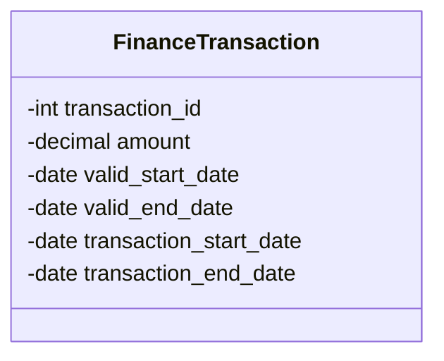

## Overview

The Bi-Temporal Data Mart Design is a crucial pattern for organizations that require comprehensive auditing, historical accuracy, and advanced analytical capabilities. This pattern allows businesses to maintain and analyze data across multiple dimensions of time, capturing both the time a fact is known and valid commercially, as well as when it is recorded in the system. It provides a robust framework for temporal data management within specialized data marts for key business functions like finance, HR, or sales.

## Detailed Explanation

### Architectural Approach

In a Bi-Temporal Data Mart, each record contains two sets of time dimensions:

1. **Valid Time**: Represents the actual time period during which a fact is true or applicable in the real world. It helps track the history of real-world changes over time.
   
2. **Transaction Time**: Represents the time period during which a fact is stored in the database. It captures when the information was entered into the system.

This dual-timing approach ensures that the data marts can facilitate sophisticated querying capabilities and ensure compliance audits through detailed historical snapshots.

### Key Components

- **Temporal Tables**: Tables in the data mart are structured to maintain temporal attributes. Standard tables will have additional columns for valid and transaction time ranges.
  
- **ETL Processes**: Extract, Transform, Load (ETL) jobs are designed to handle bi-temporal data efficiently. These processes ensure correct updates to both time dimensions during data ingestion.

- **Temporal Query Tools**: SQL and database toolsets are extended to support bi-temporal queries. This may include standard SQL extensions or specialized tools catering to temporal datasets.

### Example Code

Consider the following SQL schema for a bi-temporal table:

```sql
CREATE TABLE finance_transactions (
    transaction_id INT PRIMARY KEY,
    amount DECIMAL(10, 2),
    valid_start_date DATE,
    valid_end_date DATE,
    transaction_start_date DATE,
    transaction_end_date DATE
);
```

### Mermaid UML Diagram



### Best Practices

1. **Data Consistency**: Ensure ETL processes maintain consistent updates across both time periods.
2. **Versioning Strategy**: Track changes to records carefully with version numbers or timestamp flags to facilitate rollback.
3. **Optimized Indexing**: Apply appropriate indexing on temporal columns to accelerate query performance.

## Related Patterns

- **Slowly Changing Dimension (SCD)**: Manages changing dimensional data without temporal complexities.
- **Event Sourcing**: Captures state changes as a sequence of events, beneficial for reconstructing historical data states.

## Additional Resources

- [Temporal Data & the Relational Model](https://books.google.com) by C.J. Date et al.
- [Time Travel in Databases](https://arxiv.org) - Extensive insights on managing historical data efficiently.
- [Azure SQL Database Temporal Tables](https://learn.microsoft.com/en-us/azure/azure-sql/)

## Summary

The Bi-Temporal Data Mart Design provides a robust mechanism for managing complex temporal data requirements. By supporting dual-timing mechanisms, this pattern facilitates advanced analytical capabilities such as detailed trend analysis, forensic audits, and historic data snapshots. Organizations leveraging this design gain enhanced visibility over their operations and can better adapt to temporal dataset requirements across their business data processing and analytics infrastructure.
