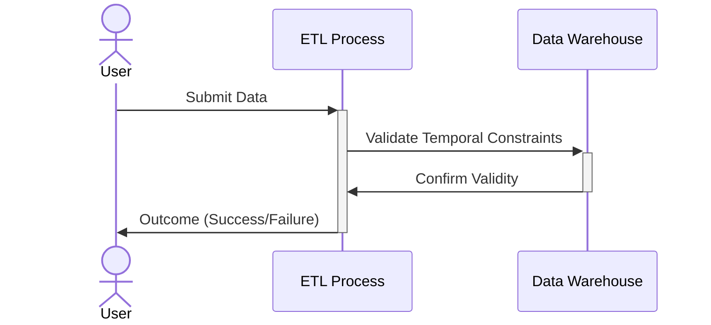
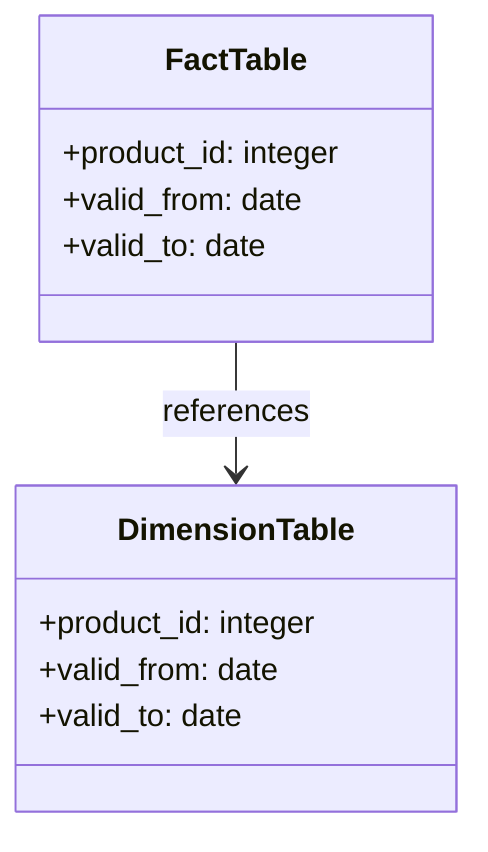

In data warehouse environments, managing temporal data accurately is crucial. Temporal integrity constraints ensure that data maintains consistency over chronological dimensions. Specifically, this design pattern addresses the need to enforce constraints such as ensuring that fact records align with dimension records within valid time boundaries.

## Architectural Approaches

To implement temporal integrity constraints within data warehouses, several strategies can be employed:

1. **Bi-Temporal Modeling**: Implementing bi-temporal data models allows storage of both historical and current data states. Using system time and valid time, these models handle data changes over time effectively.

2. **Temporal Constraints in SQL**: Enforcing temporal constraints using SQL’s CHECK, FOREIGN KEY, and other a constraint can serve as a mechanism for maintaining integrity. For example, ensuring a fact table's `valid_from` and `valid_to` dates reference corresponding dates in a dimension table.

3. **Application-Level Enforcement**: Constraints can also be enforced at the application level, which involves developing logic within ETL processes or front-end applications to validate temporal constraints before data entry or updates.

4. **Event-Driven Architecture**: Integration of event-driven systems using tools like Apache Kafka to capture and validate data in real-time as it is processed. This reduces the reliance on batch processes for data validation.

## Best Practices

- **Consistent Temporal Granularity**: Use consistent time granularity across fact and dimension tables to simplify constraint logic.
  
- **Efficient Indexing**: Proper indexing on temporal columns can enhance constraint checks and queries.

- **Data Auditing**: Maintain audit logs capturing all changes to temporal boundaries to assist in diagnosing and rectifying violations post-entry.

- **Automation**: Automate temporal constraint checks within ETL processes to streamline data integrity maintenance.

## Example Code

Here is a simplified SQL example that demonstrates how to implement a bi-temporal constraint using SQL.

```sql
ALTER TABLE fact_sales
ADD CONSTRAINT fk_sales_validity
FOREIGN KEY (product_id, valid_from, valid_to)
REFERENCES dim_products(product_id, valid_from, valid_to)
ON DELETE CASCADE
ON UPDATE CASCADE;
```

This example assumes that both `fact_sales` and `dim_products` have temporal attributes `valid_from` and `valid_to`.

## Diagrams

### Temporal Integrity Constraint Sequence



### Bi-Temporal Data Handling in Data Warehouse



## Related Patterns

- **Slowly Changing Dimensions**: Addresses the need to track changes in dimension data over time.
- **Event Sourcing**: Ensures that changes to application state are stored in a sequence of events.

## Additional Resources

- [Temporal Data & The Relational Model by C.J. Date and Hugh Darwen](https://www.elsevier.com/books/temporal-data-and-the-relational-model/date/978-1-55860-855-9)
- [The Data Warehouse Toolkit by Ralph Kimball](https://www.kimballgroup.com/data-warehouse-business-intelligence-resources/)

## Summary

Ensuring temporal integrity within a data warehouse is vital for maintaining accurate historical records and valid data changes. By utilizing SQL constraints, application-level logic, and event-driven architectures, organizations can effectively model and enforce temporal constraints. This pattern not only ensures data quality but also extends the capability to trace back through historical data accurately, aiding in auditing and data governance efforts.
