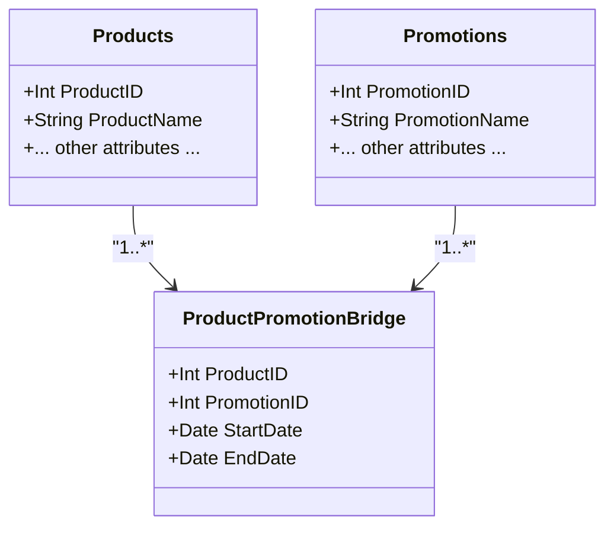

## Introduction

Effective Date Bridging is a sophisticated data modeling design pattern used in temporal and bi-temporal data warehouses to manage and query many-to-many relationships that involve periods of temporal validity. This pattern ensures that data analyses consider accurate historical and current data states.

## Problem Statement

In data warehousing, especially in domains like retail or finance, it is common to encounter many-to-many relationships. These relationships are not only complex but also often involve data that is valid over certain periods. A typical scenario could be linking products to multiple promotions that are valid for specific time intervals.

- How do we effectively query and manage the temporal aspects of these relationships?
- How can we ensure each data record reflects its accurate historical and current validity?

## Solution

The Effective Date Bridging pattern leverages a bridge table, which acts as an intermediary between two entities. This table captures the many-to-many associations and tracks their valid time ranges.

### Architectural Approach

1. **Bridge Table Design**: This table includes foreign keys from each of the tables representing the many-to-many entities (such as Product and Promotion), along with start and end effective date columns to delineate the validity period of each relationship.

2. **Temporal Validity Management**: Utilize effective date columns to define the time period when each relationship is active. This ensures accurate temporal querying.

3. **Integrity and Queries**: SQL-based querying can utilize WHERE clauses to filter based on the validity period, ensuring that you can fetch data that was valid at any specific point in time, both historically and currently.

### Example Implementation

```sql
CREATE TABLE ProductPromotionBridge (
    ProductID INT NOT NULL,
    PromotionID INT NOT NULL,
    StartDate DATE NOT NULL,
    EndDate DATE NOT NULL,
    FOREIGN KEY (ProductID) REFERENCES Products(ProductID),
    FOREIGN KEY (PromotionID) REFERENCES Promotions(PromotionID)
);

-- Example query to find active promotions on a specific date
SELECT p.ProductName, pr.PromotionName
FROM Products p
JOIN ProductPromotionBridge ppb ON p.ProductID = ppb.ProductID
JOIN Promotions pr ON ppb.PromotionID = pr.PromotionID
WHERE StartDate <= '2023-10-01' AND EndDate > '2023-10-01';
```

### Diagram

Below is a Mermaid UML class diagram that demonstrates the structural relationship within the Effective Date Bridging pattern:



## Related Patterns

- **Type 2 Slowly Changing Dimension (SCD)**: Similar in managing historical accuracy by maintaining versioned records, but focused on dimensional changes rather than relationships between entities.
- **Temporal Table Pattern**: Utilizes SQL's built-in temporal features to handle changes over time directly within the data model.

## Best Practices

- Ensure the bridge table is indexed on start and end dates to optimize temporal queries.
- Regularly review and maintain date validity to prevent overlaps and ensure consistency.
- Use database constraints and triggers to safeguard against invalid date entries and maintain data integrity.

## Additional Resources

- [Johann Farah's Temporal Data Patterns](https://jfarah.org)
- [Date Dimension in Data Warehousing by Kimball Group](https://www.kimballgroup.com)
- [Database Management for Temporal Data](https://dbengines.com)

## Summary

Effective Date Bridging is indispensable for managing temporally complex relationships in data warehousing, providing robust coverage for querying data past and present. This pattern enhances historical data accuracy while simplifying complex temporal queries—an indispensable tool for any sophisticated data environment.
