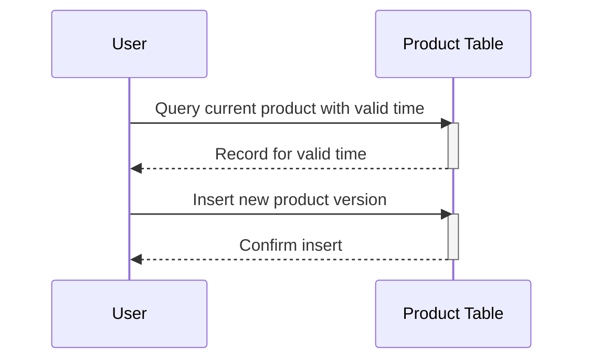

## Introduction

Bi-Temporal Slowly Changing Dimensions (SCD) Type 2 is a data warehousing design pattern that extends traditional SCD Type 2 to manage both transaction time and valid time. This pattern is particularly useful for auditing changes over time and analyzing data validity periods separately from data recording or change time.

## Description

In traditional data warehousing models, Slowly Changing Dimensions (SCD) Type 2 is used to track historical data by inserting a new record for each change. Bi-Temporal SCD Type 2 builds on this by introducing two dimensions of time:

- **Valid Time**: The time period during which a record is considered accurate or valid from a business perspective.
- **Transaction Time**: The time period when the record was actually stored or updated in the data warehouse.

This allows businesses to capture not only what the state of the data was at any given point (valid time) but also when exactly the changes were applied to the data (transaction time). Such bi-temporal tracking is instrumental for retrospective corrections and detailed audits.

## Architectural Approaches

Bi-Temporal SCD Type 2 can be implemented using separate time columns:

- `valid_from` and `valid_to` columns to capture the periods during which data records are considered valid.
- `transaction_from` and `transaction_to` columns to capture the actual periods when records were valid in the database.

### Example Table Structure

```sql
CREATE TABLE Product (
    ProductID INT,
    ProductName VARCHAR(255),
    valid_from DATE,
    valid_to DATE,
    transaction_from DATE,
    transaction_to DATE,
    PRIMARY KEY (ProductID, valid_from, transaction_from)
);
```

## Best Practices

1. **Data Integrity**: Consistently update both valid and transaction time for each change to ensure accuracy.
2. **Data Versioning**: Maintain a versioning approach that distinctly differentiates records based on valid and transaction periods.
3. **Efficient Queries**: Optimize queries to utilize bi-temporal indexes, ensuring retrieval based on either valid time or transaction time.

## Example Code

Below is an example of how to insert a new change record in a bi-temporal product dimension table:

```sql
INSERT INTO Product (ProductID, ProductName, valid_from, valid_to, transaction_from, transaction_to)
VALUES (101, 'Product X', '2024-01-01', '2024-12-31', '2024-07-01', '9999-12-31');
```

To update a product's end time for a new change:

```sql
UPDATE Product
SET valid_to = '2024-06-30', transaction_to = '2024-07-01'
WHERE ProductID = 101 AND transaction_to = '9999-12-31';
```

Then, insert the new record:

```sql
INSERT INTO Product (ProductID, ProductName, valid_from, valid_to, transaction_from, transaction_to)
VALUES (101, 'Product 1', '2024-07-01', '9999-12-31', '2024-07-02', '9999-12-31');
```

## Diagrams

Below is a Mermaid UML Sequence Diagram showing how updates are managed with valid and transaction times:



## Related Patterns

- **Temporal Tables**: Focus specifically on the valid time dimension.
- **Audit Trail**: Captures the history of all data changes with timestamp and user details without necessarily using bi-temporal control.

## Additional Resources

- [Martin Fowler: Temporal Patterns](https://martinfowler.com)
- [Kimball's Data Warehouse Design](https://www.kimballgroup.com)

## Summary

Bi-Temporal Slowly Changing Dimensions Type 2 enhances traditional SCD Type 2 design by integrating valid time and transaction time tracking, enabling complex temporal data analysis and historical data audits with precision. Through effective implementation and adhering to best practices, organizations can ensure robust data integrity and insightful historical data insights.
