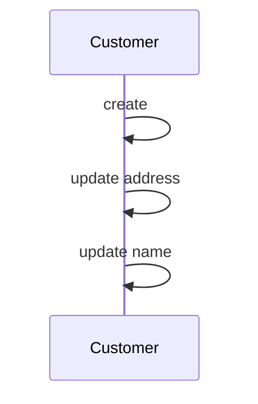

Temporal Dimensions are a crucial design pattern used in data warehousing and data modeling to capture and manage historical information accurately. This pattern involves creating dimensions that maintain records of changes over time, leveraging the concept of Slowly Changing Dimensions (SCD) Type 2 to handle bi-temporal history effectively.

## Key Concepts

### Slowly Changing Dimensions (SCD)
Slowly Changing Dimensions are dimensions that change over time, crucial for tracking historical data in a data warehouse. There are different types of SCD techniques, but Type 2 is often used for bi-temporal tracking. It allows you to:

- Track full historical data by maintaining multiple records for a single dimension.
- Record effective timing and transaction timing differentiators for each change.

### Bi-Temporal Data
Bi-temporal data refers to the ability to manage and query data along two distinct timelines: the effective time of the data in reality and the time when the changes were recorded in the system. 

## Architectural Approach

Using SCD Type 2, a table structure might include:

- **Surrogate Key**: A unique identifier for each row.
- **Natural Key**: Business identifier for reference.
- **Attributes**: Columns storing the actual data (e.g., customer name, address).
- **Effective Date**: Start and end dates to indicate the valid period for each version of the row.
- **Transaction Date**: Reflects when a record was committed to the data warehouse.

## Best Practices

- Ensure every change is captured with appropriate effective and transaction dates.
- Design queries carefully to handle complex temporal operations.
- Use database-specific features that optimize bi-temporal tracking, like `VALIDTIME` and `TRANS_SRV_TIME` in SQL databases.
  
## Example Code

Here's a sample SQL structure for a customer dimension table using SCD Type 2:

```sql
CREATE TABLE Customer_Dimension (
    SurrogateKey INT PRIMARY KEY,
    CustomerID INT, -- Natural Key
    Name VARCHAR(255),
    Address VARCHAR(255),
    EffectiveStartDate DATE,
    EffectiveEndDate DATE,
    TransactionStartDate DATE,
    TransactionEndDate DATE,
    IsCurrent BIT -- Indicator for current record
);
```

To retrieve a historical view at a specific time, you could use a query like this:

```sql
SELECT * FROM Customer_Dimension
WHERE CustomerID = ?
AND EffectiveStartDate <= @EffectiveDate
AND (EffectiveEndDate > @EffectiveDate OR EffectiveEndDate IS NULL);
```

## Diagrams

Below is a simplified conceptual diagram showcasing how different customer dimension records evolve over time using SCD Type 2:



## Related Patterns

- **Time Variance Pattern**: Focuses on variability of facts over time.
- **Temporal Validity Pattern**: Deals with periods of validity impacting data relevance and reporting.
- **Change Data Capture (CDC)**: A broader pattern for tracking changes across various systems.

## Additional Resources

- Book: "The Data Warehouse Toolkit" by Ralph Kimball and Margy Ross
- Article: [Understanding Slowly Changing Dimensions](https://www.dwhstuff.com/scd/)
- Database Vendor Docs: "Temporal Tables" SQL Server

## Summary

Temporal Dimensions provide a structured approach to capturing and managing historical changes within dimensions, specifically for bi-temporal data tracking. Leveraging Slowly Changing Dimension Type 2, this pattern maintains a comprehensive historical record, ensuring data integrity and enabling detailed temporal analysis in data warehousing solutions. Adopting this pattern is vital for organizations that require complex historical insights and trend analysis.
