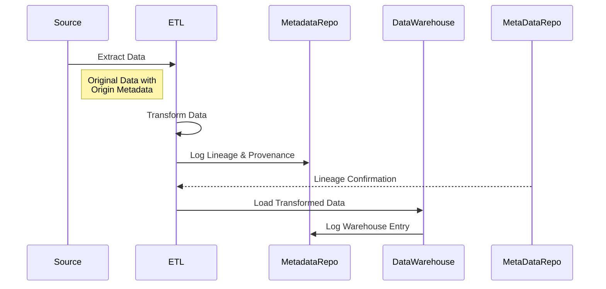

## Data Lineage and Provenance Tracking

### Introduction

In modern data architectures, especially within data warehouses, understanding the origin and transformation of data is crucial. **Data Lineage and Provenance Tracking** design pattern is critical for ensuring transparency, accountability, and trust in data across Enterprise systems. This pattern details how data flows from the initial capture point, gets transformed during processing, and is eventually stored in warehouses.

### Architectural Approach

1. **Metadata Repositories**: Establish a centralized metadata repository where every data transformation and movement is recorded along with timestamps. 

2. **ETL Instrumentation**: Enhance ETL (Extract, Transform, Load) processes to log lineage information, capturing both the source and target data schemas and the operations applied during transformation.

3. **Time-Stamping Data**: Implement time-stamping to record when data is loaded and transformed, which is essential for bi-temporal warehouses to maintain valid-time and transaction-time history.

4. **Change Data Capture (CDC)**: Use CDC techniques to track changes over time, beneficial for incrementally updating data lineage records.

5. **Tools and Technologies**: Employ tools like Apache Atlas, AWS Glue Data Catalog, or Google Cloud Data Catalog for automatic lineage tracking and visualization.

### Diagram

Here’s a simplified Mermaid diagram illustrating the data lineage and provenance tracking process:



### Best Practices

- **Standardize Metadata Capture**: Use standardized metadata formats to facilitate easy exchange and understanding of lineage data across systems.
  
- **Versioning**: Implement version control for transformations and schema changes to audit data integrity issues.

- **Automation**: Automate lineage collection using machine learning algorithms to identify patterns in data movement and transformation.

- **Secure Access**: Ensure that lineage and provenance data are accessible only to authorized users as it may contain sensitive information regarding business logic and processes.

### Example Code

The following is a pseudocode example using a Java-based ETL system that logs data lineage:

```java
public class DataLineageTracker {

    public void trackLineage(String source, String target, String transformationDetails) {
        LineageRecord record = new LineageRecord();
        record.setSource(source);
        record.setTarget(target);
        record.setTransformation(transformationDetails);
        record.setTimestamp(System.currentTimeMillis());

        MetadataRepository repository = MetadataRepository.getInstance();
        repository.saveLineageRecord(record);
    }
}
```

### Related Patterns

- **Change Data Capture (CDC)**: Focuses on identifying and tracking changes in source data to reflect those changes in downstream systems.

- **Slowly Changing Dimensions (SCD)**: Manages changes over time in dimensional data, supporting historical and current views.

- **Temporal Data Tables**: Utilizes valid-time and transaction-time to log historical data changes along with lineage records.

### Additional Resources

- **Books**: *Data Governance: The Definitive Guide* by Evren Eryurek and Jesse Anderson.
- **Tools**: Explore Apache Atlas, Informatica Data Quality, and Collibra for comprehensive data lineage management.

### Final Summary

Implementing the Data Lineage and Provenance Tracking pattern in bi-temporal data warehousing is essential for compliance, data governance, and trust in data analyses. With reliable tracking mechanisms, organizations can achieve transparency in their data processing pipelines and ensure that all stakeholder requirements around data traceability are met. It forms a foundational aspect of robust data governance strategies in modern enterprises.
