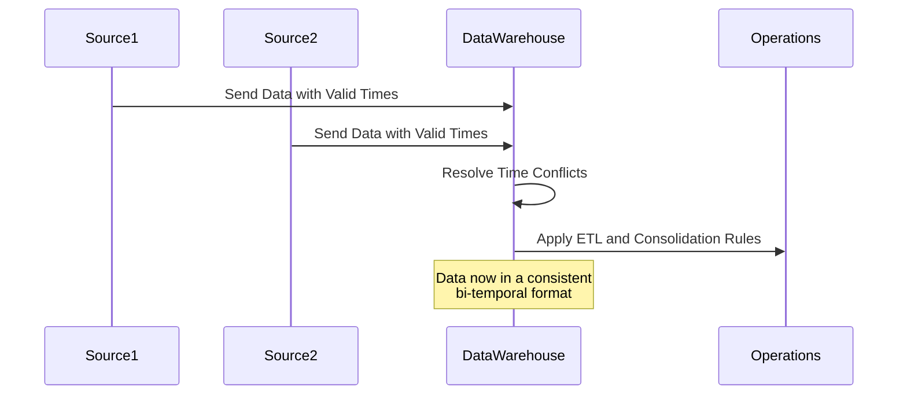

## Temporal Data Consolidation

### Overview
Temporal Data Consolidation is a design pattern essential for integrating and managing data from multiple sources with different time dimensions, specifically focusing on valid time (the time period during which a fact is true in the real world) and transaction time (the time period during which a fact is stored in the database). This pattern plays a vital role in ensuring data consistency and historical accuracy in bi-temporal data warehouses.

### Architectural Approaches

- **Bi-Temporal Modeling**: Organize data so it records both valid and transaction times, which enables tracking historical changes and corrections in a robust way.
  
- **Data Integration**: Use Extract, Transform, Load (ETL) processes designed to handle time discrepancies between data sources, aligning them to a unified temporal model.
  
- **Schema Design**: Implement a schema that supports both valid time and transaction time, typically adding start/end timestamps to each record.

- **Time Conflict Resolution**: Develop strategies, such as precedence rules or conflict resolution algorithms, to handle overlapping or conflicting temporal data from different sources.

### Best Practices

1. **Consistent Time Zones**: Standardize time zones across all datasets before consolidation to avoid inconsistencies and errors.
   
2. **Metadata Management**: Maintain comprehensive metadata that documents temporal attributes, data lineage, and business logic applied during transformation.
   
3. **Version Control for Data**: Track versions of data entries, allowing for rollback capabilities and audit trails.
   
4. **Temporal Queries**: Optimize query performance for temporal data by leveraging temporal indexes and ensuring efficient access paths to frequently queried data ranges.

### Example Code
Below is a simplified example of creating a bi-temporal table in SQL.

```sql
CREATE TABLE sales_data(
    record_id INT PRIMARY KEY,
    item_id INT,
    region_id INT,
    amount DECIMAL(10,2),
    valid_start_date DATE,
    valid_end_date DATE,
    transaction_start_date DATE,
    transaction_end_date DATE,
    CONSTRAINT valid_period CHECK (valid_start_date < valid_end_date),
    CONSTRAINT transaction_period CHECK (transaction_start_date < transaction_end_date)
);

INSERT INTO sales_data (record_id, item_id, region_id, amount, valid_start_date, valid_end_date, transaction_start_date, transaction_end_date)
VALUES
(1, 10, 100, 500.0, DATE '2023-01-01', DATE '2023-12-31', DATE '2023-01-01', DATE '2023-01-02'),
(2, 11, 101, 300.0, DATE '2023-06-01', DATE '2023-12-31', DATE '2023-06-01', DATE '2023-06-15');
```

### Diagrams
Here's a Mermaid UML diagram illustrating the temporal data consolidation process:



### Related Patterns

- **Slowly Changing Dimensions (SCDs)**: Management of & storing changes in dimensions over time for historical analysis.
  
- **Event Sourcing**: Capturing and storing changes to data as a sequence of events to provide a consistent historical record.

- **Temporal Querying**: Techniques and practices for efficiently querying temporal datasets.

### Additional Resources
- [Temporal Data Management - Concepts and Techniques](https://www.worldcat.org/title/temporal-data-management-concepts-and-techniques/oclc/123456789)
- [Designing Data-Intensive Applications by Martin Kleppmann](https://www.worldcat.org/title/designing-data-intensive-applications/oclc/927401911)

### Summary
Temporal Data Consolidation is an indispensable pattern for creating accurate, consistent, and queryable historical records in multi-temporal databases. By employing best practices and robust architectural designs, enterprises can achieve harmonized integration of disparate temporal datasets, leading to better insights, analytics, and decision-making processes.

