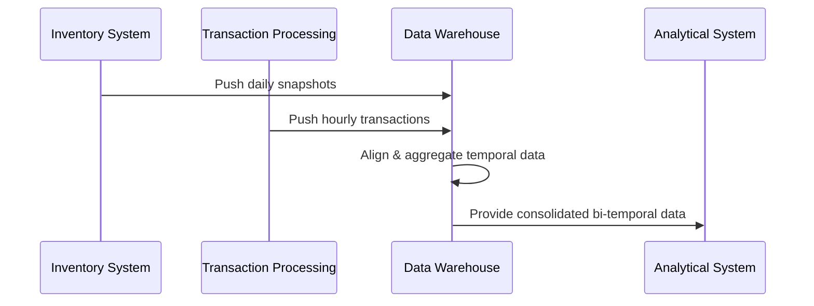

## Introduction

In data warehousing, managing bi-temporal granularity refers to handling data that has two distinct temporal dimensions—the valid time and transaction time—each possibly at different levels of granularity, such as hourly and daily. This pattern focuses on methods to integrate, align, and analyze data with distinct temporal scales to ensure cohesive and accurate analytics.

## Architectural Approaches

### 1. Temporal Alignment Strategies

Aligning data with differing temporal granularities involves choosing a strategy to unify disparate temporal dimensions. Common approaches include:

- **Normalization to the lowest granularity**: Convert all data to the most detailed temporal level. While this increases precision, it could also lead to data explosion if certain data points do not require such fine granularity.

- **Using temporal buckets**: Aggregate more granular data into coarser temporals, such as rolling up hourly data to daily levels. This helps in reducing complexity but may lose detailed insights.

### 2. Bi-Temporal Database Schema Design

Designing your schemas to incorporate both valid and transaction times with differing granularity involves:

- Using composite keys that provide a combination of business keys and temporal indicators.
- Implementing temporal tables and period data types, if supported by your database, to naturally support bi-temporal operations.

### 3. Handling Data Consistency and Integrity

Bi-temporal systems should ensure consistency across both temporal dimensions:

- **Concurrency Control**: Implement concurrency controls to handle updates happening in disparate temporals.
  
- **Data Validation Rules**: Automate validation checks that enforce business rules across the time dimensions.

## Example Code

### Example in SQL

```sql
CREATE TABLE InventorySnapshot (
    ProductID INT NOT NULL,
    SnapshotDate DATE NOT NULL,
    ValidFrom DATETIME NOT NULL,
    ValidTo DATETIME NOT NULL,
    Quantity INT,
    PRIMARY KEY (ProductID, SnapshotDate, ValidFrom)
);

CREATE TABLE Transactions (
    TransactionID INT PRIMARY KEY,
    ProductID INT,
    TransactionDate DATETIME NOT NULL,
    Quantity INT
);

-- Example Query to align daily inventory with hourly transactions
SELECT 
    i.ProductID,
    i.SnapshotDate,
    SUM(t.Quantity) as TotalTransaction
FROM 
    InventorySnapshot i
LEFT JOIN 
    Transactions t
ON 
    i.ProductID = t.ProductID 
AND 
    t.TransactionDate BETWEEN i.ValidFrom AND i.ValidTo
GROUP BY 
    i.ProductID, i.SnapshotDate;
```

## Diagrams



## Related Patterns

- **Time-Variant Historical Data**: Maintaining a historical record of changes to data over time.
- **Data Consolidation**: Integrating various data sources into a unified dataset.

## Additional Resources

- *Temporal Data & The Relational Model* by C.J. Date, Hugh Darwen
- Snowflake Documentation on Time Travel and Historical Data

## Summary

The "Managing Bi-Temporal Granularity" pattern provides essential guidelines for aligning and analyzing data with different temporal dimensions in a warehouse environment. By strategically handling data at various temporal granularities, businesses can ensure that their analyses are both precise and comprehensive, supporting robust data-driven decision-making.
