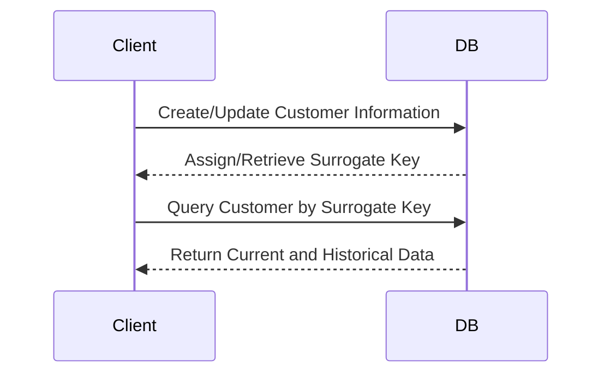

## Introduction

In the realm of data warehousing, especially in bi-temporal data environments, maintaining consistency and ease of reference through surrogate keys is crucial. The "Temporal Surrogate Key Retention" design pattern is tailored for this need by providing mechanisms to retain surrogate keys over time even as entity attributes evolve.

## Design Pattern Explanation

The Temporal Surrogate Key Retention pattern involves associating a fixed surrogate key with a business entity that does not change over the lifespan of said entity within a data warehouse. This design simplifies query logic and maintains a consistent reference to entities across different versions and timeframes.

### Architectural Approach

1. **Surrogate Key Selection**: Assign a unique surrogate key to each distinct business entity upon its creation. This key is non-volatile and independent of the entity's attributes.

2. **Temporal Data Segmentation**: Segment the entity's data into current, historical, and potentially future periods, recording changes in dedicated temporal fields such as effective date and expiry date.

3. **Bi-Temporal Modeling**: Utilize both transaction time (when data is placed in the warehouse) and valid time (when the data accurately reflects reality) for precise data representation.

4. **Change Tracking**: As attributes of the entity change (e.g., customer address changes), retain the surrogate key but update the other fields along with the temporal markers.

5. **Data Integrity Maintenance**: Implement referential integrity constraints to ensure that surrogate keys maintain valid references across related tables.

## Best Practices

- **Immutable Surrogate Keys**: Design surrogate keys as immutable, thus keeping them reliable pointers to consistent business identities.
  
- **Effective and Expiry Columns**: Use columns for beginning and end validity dates of records to manage bi-temporal attributes effectively.
  
- **Version History Tables**: Store entity changes in a history or archive table to allow rollback and audit capabilities, enhancing data lineage and accountability.

- **Error Handling and Validation**: Incorporate error-checking mechanisms for surrogate key allocation and temporal validity to prevent downstream data quality issues.

## Example Code

Let's look at an SQL-based example to outline the implementation of this pattern for a customer data warehouse table:

```sql
CREATE TABLE Customer (
  SurrogateKey INT PRIMARY KEY,
  CustomerID VARCHAR(255),
  Name VARCHAR(255),
  Address VARCHAR(255),
  EffectiveDate DATE,
  ExpiryDate DATE,
  ValidTimeStart DATE,
  ValidTimeEnd DATE
);

-- Example of maintaining a surrogate key
-- Even if the customer's address changes, the SurrogateKey remains the same
INSERT INTO Customer (SurrogateKey, CustomerID, Name, Address, EffectiveDate, ExpiryDate, ValidTimeStart, ValidTimeEnd) 
VALUES (1, 'CUST001', 'John Doe', '123 Elm St', '2023-01-01', '9999-12-31', '2023-01-01', '2099-12-31');
```

## Diagram

Here is a UML Sequence Diagram that depicts the process of managing a temporal surrogate key:



## Related Patterns

- **Slowly Changing Dimensions (SCD)**: Techniques for managing changes in dimension table attributes in data warehouses.

- **Temporal Table Pattern**: Utilizing temporal tables for managing data that varies over time and supports versioning of records.

## Additional Resources

- [Data Warehousing and Bi-Temporal Data](#)
- [Designing for Historical Integrity in Data Systems](#)
- [Surrogate Keys in Business Intelligence Systems](#)

## Summary

The Temporal Surrogate Key Retention pattern is foundational for consistently referencing business entities in bi-temporal data warehouses. By persisting surrogate keys, organizations gain the flexibility to manage historical data without compromising referential integrity, thus enriching analytical capabilities and ensuring robust data quality.

By adopting this pattern, data architects can ensure streamlined storage of temporal changes and simplify analytical queries, ultimately enhancing the organization's decision-making processes.
