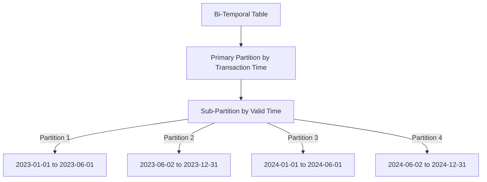

## Bi-Temporal Partitioning Strategy

### Introduction

The Bi-Temporal Partitioning Strategy is crucial in data warehousing scenarios where both transaction time and valid time need to be captured and managed effectively. In bi-temporal databases, it becomes essential to maintain a record not only of when data is valid from a business perspective but also when it was entered or changed in the system. This design pattern addresses these requirements and optimizes query performance and data retrieval efficiency.

### Detailed Explanation

#### Defining Bi-Temporal Data

- **Transaction Time**: Reflects when the data was stored in the database.
- **Valid Time**: Denotes the time period during which the data is valid from a business perspective.

#### Partitioning Challenges

Partitioning bi-temporal tables can be complex due to the need to efficiently manage and query based on both transaction and valid times. Without strategic partitioning, query performance can degrade, and storage can become inefficient.

### Partitioning Strategy

One robust approach is to utilize a hierarchical partitioning strategy:

1. **Primary Partition by Transaction Time**:
   - The first level of partitioning is based on the transaction time, which is often when data was loaded or altered in the database. This caters to queries dealing with version history or data lineage.

2. **Sub-Partition by Valid Time**:
   - Further, sub-partition the data using valid time within each transaction time partition. This allows quick access to data based on its business temporal validity, improving time-slice queries.

By organizing data in this manner, you facilitate efficient access to historical data as well as current valid datasets, while also optimizing storage and performance management.

### Example Code

Consider a data warehousing solution using a SQL database:

```sql
CREATE TABLE Sales
(
    SaleID INT,
    ProductID INT,
    TransactionDate DATE,
    ValidFromDate DATE,
    ValidToDate DATE,
    Amount DECIMAL(10, 2),
    PRIMARY KEY (SaleID)
)
PARTITION BY RANGE (TransactionDate) 
SUBPARTITION BY RANGE (ValidFromDate);

CREATE PARTITION p0 VALUES LESS THAN (DATE '2023-01-01')
   SUBPARTITION s0 VALUES LESS THAN (DATE '2023-06-01'),
   SUBPARTITION s1 VALUES LESS THAN (DATE '2023-12-31');

CREATE PARTITION p1 VALUES LESS THAN (DATE '2024-01-01')
   SUBPARTITION s2 VALUES LESS THAN (DATE '2024-06-01'),
   SUBPARTITION s3 VALUES LESS THAN (DATE '2024-12-31');
```

### Diagram



### Best Practices

- Align partitions with the workload patterns you anticipate. For example, if month-end reporting is common, consider monthly partitions.
- Regularly analyze usage patterns and adjust partitions accordingly to ensure optimal performance.
- Use database features that support interval or range partitioning suitable for dates to manage partitions easily.

### Related Patterns

- **Slowly Changing Dimensions (SCD)**: Handle historical changes to dimensions over time.
- **Temporal Data Tables**: Manage data variations effectively across periods.
- **Data Archiving Strategy**: Efficiently manage historical data in a warehouse system.

### Additional Resources

- "Temporal Data and the Relational Model" by C.J. Date et al.
- Database vendor documentation on partitioning (e.g., Oracle, PostgreSQL).

### Summary

The Bi-Temporal Partitioning Strategy is an effective approach for managing complex bi-temporal data structures in a data warehouse. By smartly partitioning tables using both transaction and valid times, you can assure a high degree of efficiency and performance. Moreover, this setup provides a structured framework for handling detailed historical data and improving data retrieval speed and accuracy.


This comprehensive partitioning strategy facilitates transactional history analysis alongside business-valid timeframe inquiries, enhancing both operational capabilities and strategic insights for businesses leveraging data warehousing solutions.
