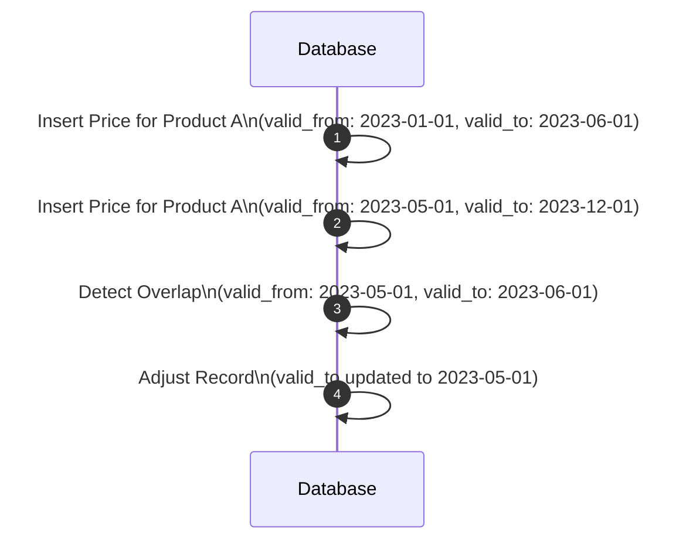

## Introduction

Handling temporal data anomalies is crucial for maintaining data integrity and ensuring accurate analytical insights in bi-temporal data warehouses. Temporal data often embodies time-based information that can suffer from issues such as overlapping time periods, missing intervals, or incorrect sequence of events. Resolving these anomalies ensures that the historical and current state of data is correctly represented.

## Challenges in Temporal Data

In a bi-temporal system, data is often tracked across two timelines: the valid time (when the data is true in the real world) and the transaction time (when the data is stored in the database). Common anomalies include:

- **Overlapping Periods**: Occurs when records have overlapping valid times with potentially conflicting data.
- **Gaps in Time**: Arise when there are missing time intervals that should be filled with data.
- **Out-of-Order Events**: Reflect incorrect sequential recording of data events, undermining data integrity.

## Design Approach

Implementing a robust strategy for anomaly detection and resolution involves:

1. **Temporal Normalization**: Ensure data entries do not overlap unless explicitly allowed.
2. **Use of Constraints**: Leverage database constraints to enforce non-overlapping and ordered periods.
3. **Anomaly Detection Algorithms**: Apply algorithms to detect temporal anomalies, using SQL queries or scripts.
4. **Data Correction Strategies**: Outline correction protocols for each type of anomaly detected.

### Example Code

For simplicity, consider a product pricing table in a SQL database to maintain consistent product prices:

```sql
-- Create table with primary key and check constraints
CREATE TABLE product_pricing (
    product_id INT,
    price DECIMAL(10, 2),
    valid_from DATE,
    valid_to DATE,
    PRIMARY KEY (product_id, valid_from),
    CHECK (valid_from < valid_to)
);

-- Query to detect overlapping periods
SELECT a.product_id, a.valid_from, a.valid_to, b.valid_from, b.valid_to
FROM product_pricing a
JOIN product_pricing b
ON a.product_id = b.product_id
AND a.valid_from < b.valid_to
AND a.valid_to > b.valid_from
AND a.valid_from != b.valid_from;
```

### Diagram Representation

Below is a diagram illustrating the potential overlapping valid times and how they are resolved:



## Best Practices

- **Data Validation**: Regularly run validation scripts to catch temporal anomalies.
- **Event Sourcing**: Maintain a log of changes to understand the evolution of data over time.
- **Temporal Frameworks**: Utilize frameworks or libraries dedicated to handling temporal data patterns.

## Related Patterns

- **Slowly Changing Dimensions (SCDs)**: Manage historical data changes over time, especially suitable for Type 2 SCDs.
- **Event Sourcing**: Ideal for systems where keeping a full history of events is necessary.

## Additional Resources

- [Temporal Tables in SQL](https://docs.microsoft.com/en-us/sql/relational-databases/tables/temporal-tables-overview)
- [Temporal Data Management Patterns](https://martinfowler.com/articles/patterns-of-temporal-data-intro.html)
- [SQL:2011 Time-Based Extensions](https://en.wikipedia.org/wiki/ISO/IEC_9075-2:2011)

## Summary

Handling temporal data anomalies is crucial for organizations relying on accurate historical data. By implementing robust detection and correction mechanisms, companies ensure that their data warehouses represent true, reliable, and actionable insights. This design pattern provides foundational strategies for maintaining data integrity and supports advanced analytical applications.
