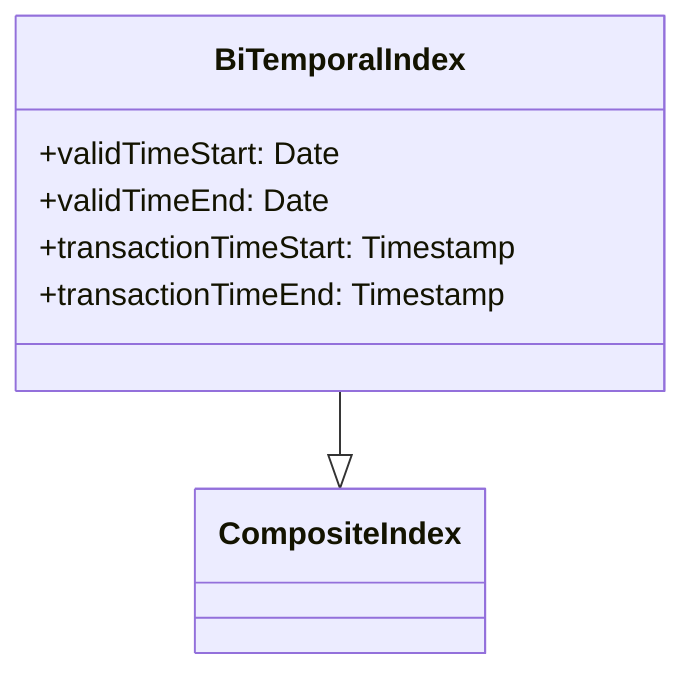

Bi-temporal databases are crucial for handling transactional and historical data with precision. Query optimization in such databases involves sophisticated strategies to ensure accurate and performant access to bi-temporal data, defined by both valid and transaction times.

## Detailed Explanation

### Introduction

Bi-temporal data systems manage two dimensions of time:  
- **Valid Time**: The time period during which a fact is true in the real world.  
- **Transaction Time**: The time period during which a fact is stored in the database.  

Queries in bi-temporal databases need to efficiently navigate these temporal dimensions, often requiring special optimizations to handle large datasets effectively.

### Architectural Approaches

1. **Composite Indexing**: 
    - **Concept**: Create composite indexes that span both valid and transaction time attributes.
    - **Benefit**: Allows quick filtering and joining operations, minimizing the search space during query execution.
    - **Implementation Example**:
      ```sql
      CREATE INDEX idx_bitemporal
      ON table_name(valid_time_start, valid_time_end, transaction_time_start, transaction_time_end);
      ```

2. **Query Rewriting**:
    - **Concept**: Transform complex bi-temporal queries into simpler forms that leverage existing indexes.
    - **Benefit**: Faster execution by avoiding computation of conditions that can be pre-filtered.
    - **Typical Transformation**:
      - Breaking down complex temporal predicates into simpler range queries.

3. **Materialized Views**:
    - **Concept**: Precompute and store common bi-temporal queries as materialized views.
    - **Benefit**: Provides performance improvements by reading pre-aggregated data.
    - **Example Use Case**: Pre-aggregation of time-based analytics for reporting.

### Best Practices

- **Use Partitioning**: Horizontally partition data based on time intervals, aiding parallel query execution and efficient scanning.
- **Temporal Compression**: Use advanced compression techniques to store temporal data efficiently, significantly reducing storage overhead.
- **Monitor Index Usage**: Regularly review index usage statistics to maintain only those beneficial indices, minimizing maintenance costs.

### Example Code

For query rewriting, consider transforming a bi-temporal join:

Before optimization:
```sql
SELECT a.*
FROM table_a a
JOIN table_b b
ON a.id = b.id
WHERE a.valid_time_start <= CURRENT_DATE AND a.valid_time_end >= CURRENT_DATE
AND b.transaction_time_start <= CURRENT_TIMESTAMP AND b.transaction_time_end >= CURRENT_TIMESTAMP;
```

After optimization:
```sql
SELECT a.*
FROM table_a a
JOIN table_b b
ON a.id = b.id
AND a.valid_time_start <= CURRENT_DATE
AND a.valid_time_end >= CURRENT_DATE
AND b.transaction_time_start <= CURRENT_TIMESTAMP
AND b.transaction_time_end >= CURRENT_TIMESTAMP
AND EXISTS (
  SELECT 1 
  FROM index_hint 
  WHERE hint = 'USE_INDEX')
```

### Diagrams

#### UML Diagram - Temporal Index Structure


### Related Patterns

- **SCD Type 2 (Slowly Changing Dimensions)**: Handles historical data tracking in data warehouses, offering another approach to managing historical temporal data.
- **Snapshot Isolation**: In multi-version databases, to handle multiple timelines effectively.

### Additional Resources

- **Temporal Data & the Relational Model** by Richard T. Snodgrass: An in-depth look at temporal data management.
- **SQL Performance Explained** by Markus Winand: Offers techniques for SQL optimization tailored for modern databases.

## Summary

The Bi-Temporal Query Optimization pattern details methodologies to efficiently query bi-temporal data structures. By implementing composite indexing, query rewriting, and leveraging tools like materialized views, it's possible to significantly boost the performance of temporal queries. Understanding and applying these techniques ensure accurate and efficient temporal data processing, crucial for modern data-driven businesses.
