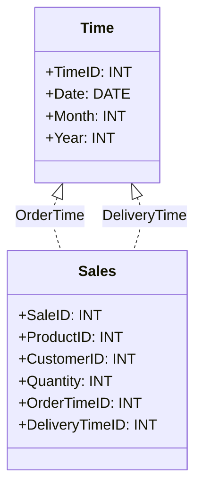

## Introduction

In the field of data warehousing, especially when dealing with bi-temporal data, the concept of Temporal Role Playing Dimensions becomes instrumental. This design pattern leverages the flexibility of using a single dimension table multiple times within a data model, each instance representing a different time context. The key idea is to manage and interpret the temporal dimensions in a way that benefits diverse analytical queries and insights, especially when dealing with both valid time and transaction time.

## Design Pattern Explanation

**Temporal Role Playing Dimensions** allow the replication of a dimension table so that the same `Time` dimension can be used multiple times in the fact table, each for a distinct temporal tracking purpose. This capability adds versatility to the design, supporting complex time-based queries without redundantly maintaining separate tables.

### Temporal Contexts

1. **Valid Time**: Represents the actual time period during which a fact is considered true.
2. **Transaction Time**: Indicates when the fact was stored or recorded in the database.

An appropriate analogy is casting dimension roles in theater – the same actor (dimension table) can play different roles (contexts).

## Example

Consider a business requirement where sales data involves tracking both the order processing time and the delivery time. Here, the same `Time` dimension is used twice:
- **Order Time (Valid Time)** in a sale fact table.
- **Delivery Time (Transaction Time)** as another role in the same or another fact table.

This configuration allows detailed temporal analysis while maintaining a simple data model.

```sql
CREATE TABLE Time (
  TimeID INT PRIMARY KEY,
  Date DATE,
  Month INT,
  Year INT,
  -- additional attributes
);

CREATE TABLE Sales (
  SaleID INT PRIMARY KEY,
  ProductID INT,
  CustomerID INT,
  Quantity INT,
  OrderTimeID INT,
  DeliveryTimeID INT,
  FOREIGN KEY (OrderTimeID) REFERENCES Time(TimeID),
  FOREIGN KEY (DeliveryTimeID) REFERENCES Time(TimeID)
);
```

## Architectural Diagram



## Best Practices

- **Consistent Naming Conventions**: Clearly differentiate dimension usages by naming the roles explicitly in the implementations (e.g., `OrderTime` vs `DeliveryTime`).
- **Efficient Indexing**: Index the time dimension tables effectively to optimize query performance.
- **Clear Temporal Definitions**: Clearly document the valid and transaction times for data consumers to understand the temporal context of each role.

## Related Patterns

- **Slowly Changing Dimensions (SCD)**: To handle dimension changes over time.
- **Bi-Temporal Modeling**: To manage historical data with dual timelines effectively.

## Additional Resources

- ["The Data Warehouse Lifecycle Toolkit" by Ralph Kimball](https://www.kimballgroup.com)
- [Temporal Database Concepts (Wikipedia)](https://en.wikipedia.org/wiki/Temporal_database)

## Summary

Incorporating Temporal Role Playing Dimensions is a powerful design pattern for bi-temporal data warehouses, allowing reusability and flexibility in data modeling. By using dimensions in multiple temporal contexts, organizations can realize significant efficiencies and enhanced analytical capabilities. Understanding and applying this pattern require strategic planning and a clear grasp of temporal concepts, ultimately leading to more robust and insightful data warehousing solutions.
