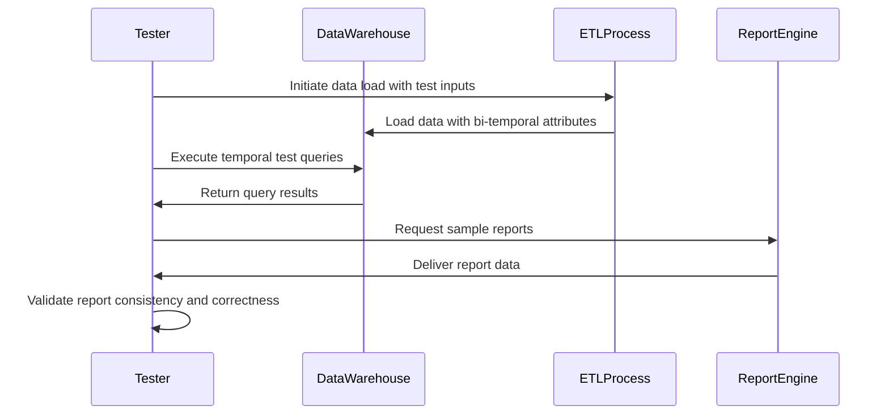

## Introduction

Bi-temporal data warehousing involves storing and managing data across two timelines: the valid time (when the data is actually valid) and the transaction time (when the data is stored in the system). This approach is crucial for businesses that need to track changes over time accurately, allowing them to analyze both current and historical states of their data.

Testing bi-temporal data warehouses verifies that the complex transformations and loading processes do not corrupt these dual timelines. It ensures that queries over historical data produce accurate and expected results, even after corrections or backdated changes.

## Architectural Approach

### Key Concepts

- **Valid Time**: The period during which a piece of data is accurate in the real world.
- **Transaction Time**: The point in time when the data is entered into or modified within the database.
- **Temporal Consistency**: Ensuring that all data reflects accurate valid and transaction timelines without anomalies.

### Example Test Case

Given a sales order entered with a transaction time of July 1, 2024, but valid from June 25, 2024, testers should verify that:

1. The order is queryable according to its valid and transaction time.
2. Any reports for June reflect pre-June 25 sales figures accurately.
3. Modifications or corrections to the order are appropriately reflected with updated transaction times.
   
Example testing query:
```sql
SELECT *
FROM sales_order
WHERE valid_time_start <= '2024-06-25'
AND transaction_time <= '2024-07-01';
```

### Testing Layers

1. **ETL Process Testing**: Ensures data is correctly ingested from source systems with accurate temporal attributes.
2. **Temporal Consistency Testing**: Validates that updates and corrections to data do not disrupt the bi-temporal integrity.
3. **Report Validation**: Confirms that end-user reports and analytics reflect accurate historical data up to the bi-temporal boundaries.

## Best Practices

- **Automated Testing Frameworks**: Utilize tools such as Apache Airflow or Jenkins for scheduling regular bi-temporal tests.
- **Versioning in Testing**: Make use of version control to retain historical test scripts and datasets, enabling point-in-time validations.
- **Delta Testing**: Focus on incremental changes between valid time snapshots to identify precision errors.
- **Parallel Environments**: Test across mirrored environments to catch discrepancies in production vs. test datasets.

## Diagrams

### Example Sequence Diagram for Bi-Temporal Testing



## Related Patterns

- **Slowly Changing Dimensions (SCD Type 2)**: Captures historical changes by preserving previous records.
- **Temporal Pattern**: Generic pattern dealing with aspects of time in data.
- **Audit Logging**: Maintains a history of transactions that can provide insights into the evolution of data over time.

## Additional Resources

- [Temporal Databases: Use Cases and Challenges](https://www.temporaldb.com/use-cases)
- [Time-Varying Data in Database Systems](https://www.timemodeling.com)
- [Designing a Bi-Temporal Data Warehouse](https://www.bitemporaldw.com/guidelines)

## Summary

Bi-temporal data warehouse testing is a sophisticated process that plays a vital role in ensuring the reliability of analytics that rely on temporal accuracy. By employing best practices such as automated testing, maintaining parallel environments, and focusing on delta testing, enterprises can ensure the integrity of their temporal data, thus gaining trust in their decision-making and reporting accuracy.
