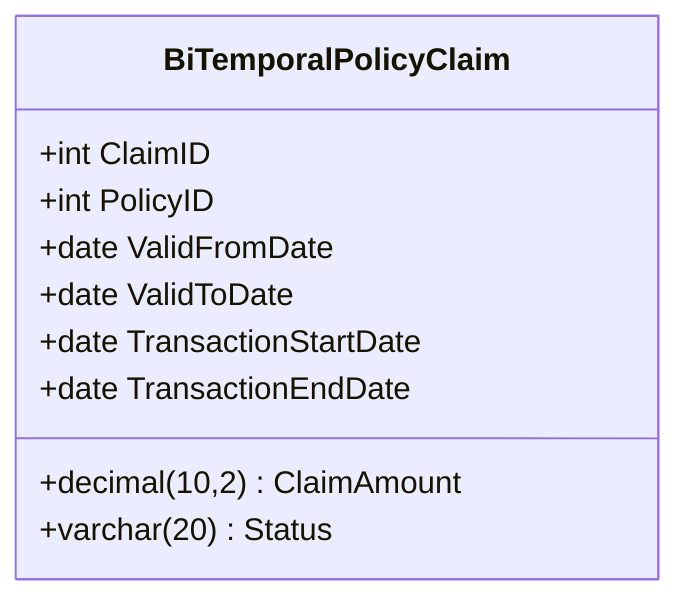

### Overview

**Bi-Temporal Fact Tables** are an advanced data warehousing pattern that captures two dimensions of time for each record: the time when the event or process occurred (valid time) and the time when the information about the event was recorded, modified, or entered into the system (transaction time). This pattern is crucial for providing a complete historical view of both business operations and information management, making it indispensable for businesses that require detailed auditing, backtracking, and historical analysis capabilities.

### Detailed Explanation

In traditional fact tables, data is usually captured based on the transaction date when the event was recorded. However, this overlooks the possibility of retrospective changes or updates that might occur due to data corrections, late data entry, or backdating. Bi-temporal fact tables solve these limitations by incorporating both the valid time (when the event actually occurred) and the transaction time (when data regarding the event was recorded or modified in the system).

#### Components

1. **Valid Time**: This captures the actual time of the business event. It is an essential attribute for understanding the chronological sequence of events as they happened.
   
2. **Transaction Time**: This aspect records when the event data was entered or altered in the database. It is useful for auditing purposes and understanding the history of data changes and corrections.

### Example Code

Let's consider a simplified example of a `PolicyClaim` fact table:

```sql
CREATE TABLE BiTemporalPolicyClaim (
    ClaimID INT PRIMARY KEY,
    PolicyID INT,
    ClaimAmount DECIMAL(10, 2),
    ValidFromDate DATE NOT NULL, -- valid time start
    ValidToDate DATE,            -- valid time end, NULL means current
    TransactionStartDate DATE NOT NULL,
    TransactionEndDate DATE,     -- transaction time end, NULL means current
    Status VARCHAR(20),
    CONSTRAINT chk_valid_date CHECK (ValidFromDate <= ValidToDate OR ValidToDate IS NULL),
    CONSTRAINT chk_transaction_date CHECK (TransactionStartDate <= TransactionEndDate OR TransactionEndDate IS NULL)
);
```

### Diagrams

Here is a conceptual depiction using a Mermaid Class diagram:



### Related Patterns

- **Slowly Changing Dimensions (SCDs)**: This pattern focuses on handling changes in dimension tables but lacks the dual temporal aspect.
- **Temporal Tables**: Similar in tracking data history but may not distinctly manage valid and transaction times.

### Additional Resources

- *Temporal Data & the Relational Model* by C.J. Date, Hugh Darwen, and Nikos Lorentzos: An authoritative text on managing temporal data within relational databases.
- [Bi-Temporal Modeling in SQL](https://example.com/Bi-Temporal-SQL): Online resource discussing practical implementation strategies for bi-temporal data modeling.

### Summary

Bi-Temporal Fact Tables are a sophisticated design pattern enabling organizations to maintain rich historical records for both event occurrences and data change events. This dual aspect provides remarkable capabilities for data auditing, compliance checks, and the precise reconstruction of past states, supporting robust data analysis and business intelligence development. As businesses increasingly rely on data-driven decisions, bi-temporal data warehousing patterns are becoming essential for capturing, managing, and leveraging historical data comprehensively.
