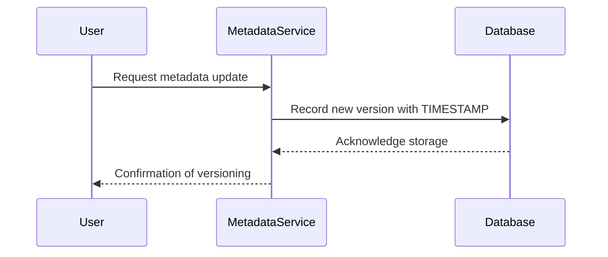

## Temporal Metadata Versioning

### Description

Temporal Metadata Versioning is a pattern that focuses on managing and tracking the evolution of metadata over time. This approach is crucial for environments where data definitions, transformations, and workflows evolve rapidly, such as in large-scale data warehouses and BI systems. By implementing Temporal Metadata Versioning, organizations can support impact analysis, enhance data lineage, and facilitate auditing processes.

### Key Concepts

- **Metadata Versioning**: Each change to metadata is versioned and time-stamped to maintain a historical record.
- **Bi-Temporal Data**: Involves two timelines—transaction time (when the data was stored) and valid time (when the data is applicable).
- **Impact Analysis**: Understanding how changes in metadata impact data products and downstream systems.
- **Auditing**: Provides a trail of metadata changes for compliance and governance.

### Architectural Approaches

1. **Bi-Temporal Tables**: Design tables to store both the current state of metadata and its historical changes using transaction time and valid time fields.
2. **Version Control Systems**: Integrate with Git-like systems for storing versions of ETL scripts and transformation logic.
3. **Metadata Layer**: Develop a dedicated layer that handles metadata well as its versioning logic, separate from the transactional data layers.
4. **Temporal Database Features**: Utilize temporal features from databases like PostgreSQL or Oracle that inherently support temporal queries and auditing.

### Best Practices

- **Consistent Versioning**: Ensure each type of metadata, from schema definitions to ETL scripts, is versioned consistently across the data pipeline.
- **Time-Stamping Policies**: Define clear policies for time-stamping and handling concurrent changes to the metadata.
- **Automation**: Automate the collection and storage of metadata changes to reduce overhead and human error.
- **Governance and Security**: Implement access controls and monitoring around who can edit metadata to ensure compliance and security.

### Example Code

Here’s a simplified example using SQL for a bi-temporal table designed to track schema changes:

```sql
CREATE TABLE schema_versions (
    schema_id SERIAL PRIMARY KEY,
    table_name VARCHAR(255) NOT NULL,
    column_definitions JSON NOT NULL,
    valid_time_start TIMESTAMP NOT NULL,
    valid_time_end TIMESTAMP DEFAULT '9999-12-31',
    transaction_time TIMESTAMP DEFAULT CURRENT_TIMESTAMP,
    author VARCHAR(100) NOT NULL,
    remarks TEXT
);

-- Insert a New Version
INSERT INTO schema_versions (table_name, column_definitions, valid_time_start, author, remarks)
VALUES ('orders', '{"order_id":"INT","order_date":"DATE"}', NOW(), 'jane.doe', 'Initial version');

-- Update Schema, keep history
UPDATE schema_versions
SET valid_time_end = NOW()
WHERE table_name = 'orders'
AND valid_time_end = '9999-12-31';

INSERT INTO schema_versions (table_name, column_definitions, valid_time_start, author, remarks)
VALUES ('orders', '{"order_id":"INT","order_date":"DATE","customer_id":"INT"}', NOW(), 'john.smith', 'Added customer_id column');
```

### Diagrams

Here is a Mermaid UML Sequence diagram illustrating how metadata is updated and versioned over time:



### Related Patterns

- **Event Sourcing**: Utilizes historical records (event log) to rebuild state, similar to maintaining metadata history.
- **Change Data Capture (CDC)**: Captures changes in a data source, useful for identifying and propagating metadata changes.
- **Temporal Table Pattern**: Extends the idea of bi-temporal databases but focuses on versioning actual data rather than metadata.

### Additional Resources

- *Managing Time in Relational Databases: How to Design, Update and Query Temporal Data* by Tom Johnston, Randall Weiss
- Oracle's Temporal Data Features Documentation
- PostgreSQL documentation on Temporal Data Types

### Summary

Temporal Metadata Versioning is a pivotal design pattern for organizations aiming to maintain a robust and auditable data environment. By systematically versioning every change to metadata, businesses can achieve higher regulatory compliance, facilitate thorough impact analyses, and empower data stewardship initiatives. Implementing this pattern requires considering aspects from table design to utilizing features provided by modern databases, paving the way for enhanced data governance and operational agility.
