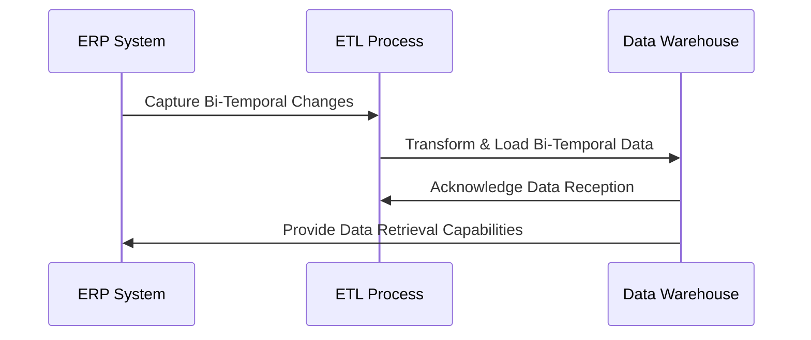

## Introduction

In the realm of data warehousing, integrating data from operational systems that employ a bi-temporal approach introduces unique complexities. Bi-temporal data systems manage both the valid time (real-world time when the data is legitimate) and the transaction time (the time when data is stored in the database). This dual approach allows accurate point-in-time analyses and audits. The challenge lies in ensuring that data warehouses effectively capture and manage the bi-temporal properties without losing either temporal aspect.

## Design Pattern: Integration with Bi-Temporal Operational Systems

### Context

Operational systems increasingly use bi-temporal models to store data, accurately reflecting changes over time and supporting complex audit requirements. To leverage this data for analytical purposes, data warehouses must seamlessly ingest and manage bi-temporal data.

### Problem

The key challenges addressed by this pattern include:

- Capturing both valid and transaction times without loss.
- Synchronizing updates from operational systems to reflect changes in both temporal dimensions.
- Supporting historical analyses and pinpointing data correctness at specific times.

### Solution

Implement an integration pipeline that respects bi-temporal characteristics using the following elements:

1. **Data Capture**: Utilize Change Data Capture (CDC) mechanisms to detect changes in bi-temporal data.
   
2. **Schema Design**: Design warehouse tables to identify both valid time and transaction time attributes. Standard practices involve creating columns such as `valid_start_date`, `valid_end_date`, `transaction_start_date`, and `transaction_end_date`.

3. **ETL/ELT Pipeline**: Construct transformation pipelines that preserve both temporal dimensions during data ingestion.
   
4. **Versioning**: Implement bi-temporal versioning within the warehouse to track and reconcile history.

5. **Temporal Indexing**: Use indexing strategies tailored to optimize bi-temporal queries efficiently.

### Example Scenario

Consider an ERP system that captures sales transactions with bi-temporal attributes: 

```sql
CREATE TABLE sales (
    sales_id SERIAL PRIMARY KEY,
    product_id INT,
    quantity INT,
    valid_start_date TIMESTAMP,
    valid_end_date TIMESTAMP,
    transaction_start_date TIMESTAMP,
    transaction_end_date TIMESTAMP
);
```

When imported into a warehouse, ensure the ETL pipeline uses these attributes to maintain history and reconcile temporal changes. Below is an example transformation process:

```sql
INSERT INTO sales_warehouse (
    sales_id, product_id, quantity, valid_start_date, valid_end_date, 
    transaction_start_date, transaction_end_date
)
SELECT
    s.sales_id, s.product_id, s.quantity, 
    s.valid_start_date, s.valid_end_date, 
    CURRENT_TIMESTAMP AS transaction_start_date, 
    null AS transaction_end_date
FROM 
    incoming_sales s
ON CONFLICT (sales_id) 
DO UPDATE SET 
   valid_end_date = EXCLUDED.valid_end_date,
   transaction_end_date = EXCLUDED.transaction_end_date;
```

### Architecture Diagram

Here is a conceptual diagram using Mermaid UML illustrating the data flow in the integration process:



### Related Patterns

- **Change Data Capture (CDC) Pattern**: This pattern involves capturing and logging changes in operational data to maintain consistency in downstream applications.
  
- **Data Auditing Pattern**: Ensures that changes in data can be tracked over time, meeting compliance and data governance requirements.

### Additional Resources

- Kimball, Ralph. "The Data Warehouse Toolkit: The Definitive Guide to Dimensional Modeling."
- Snodgrass, Richard T. "Developing Time-Oriented Database Applications in SQL."
- Gartner's Insights on Temporal Data Management Strategies

## Summary

Integrating with bi-temporal operational systems is crucial for businesses that require accurate historical insights and future projections. By following this design pattern, data from such operational systems can be curated and stored in a warehouse without losing temporal fidelity, thus supporting complex analytical workloads and audits. The integration process, including the schema design, ETL/ELT pipelines, and query optimization, ensures robust and efficient bi-temporal data management.
