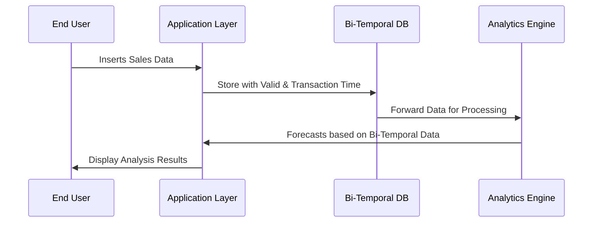

## Advanced Temporal Analytics

### Overview

Advanced Temporal Analytics refers to the implementation of sophisticated analytical methods that utilize bi-temporal data structures for more accurate predictive modeling and forecasting. In bi-temporal data management, each data entry is associated with two timelines: the transaction time, when the event is recorded, and the valid time, the period during which the data is considered true in the real world. This approach allows for complex analysis, accommodating changes and corrections to historical data without losing track of original entries, which is essential for accurate historical analysis and future projections.

### Detailed Explanation

#### Bi-Temporal Data Concepts

- **Transaction Time**: The time when data is stored in the system. It remains constant regardless of any changes made to the actual data.
- **Valid Time**: The time period over which the data is valid in the real-world context. Changes in valid time can occur due to corrections or updates in the information.

#### Architectural Approach

1. **Data Ingestion**: Ensure data is captured with metadata about both transaction and valid time, possibly using standardized formats.
2. **Storage Design**: Utilize data models that accommodate dual timelines in databases — often these are columnar storages well-suited for time-series insights, such as Apache Cassandra or time-series optimized databases like TimescaleDB.
3. **Analytical Services**: Implement analytics tools that can leverage both transaction and valid time. Such tools should be capable of aligning historical data with real-time events to perform predictive modeling effectively.

### Example Use Case

Consider a retail business that collects sales transaction data:

- **Historical Transactions**: Track every sale with both transaction and valid times.
- **Data Adjustments**: Amend the data post-transaction when a sale is returned or a discovery is made about a past entry mistake.
- **Analytics**: Use tools like Apache Kafka for real-time data streaming combined with batch processing systems like Apache Flink to carry out both real-time and batch analysis for forecasting future sales while considering historical data variations.

### Best Practices

- **Accurate Metadata Integration**: Maintain consistent transaction and valid time information across all data entries.
- **Time-Aware ETL Pipelines**: Ensure that Extract, Transform, Load (ETL) processes are cognizant of the dual timeline for accurate information processing.
- **Data Correction Protocols**: Adopt robust protocols for handling data corrections while maintaining historical integrity.

### Diagram

Below is a basic Mermaid sequence diagram outlining a typical bi-temporal data flow.

### Related Patterns

- **Time-Based Versioning**: Managing and comparing variations of data over time.
- **Event Streaming Patterns**: Streaming data management to accommodate real-time data changes and processing needs.

### Additional Resources

- [Temporal Data & Applications](https://example.com/temporal-data-guide)
- [Bi-Temporal Modeling for Real-World Applications](https://example.com/bi-temporal-modeling)
- [Advanced Forecasting Techniques in Data Warehouses](https://example.com/forecasting-techniques)

### Summary

Advanced Temporal Analytics enables dynamic data analysis and forecasting by harnessing the full potential of bi-temporal data stores. By maintaining both transaction and valid times, organizations gain the advantage of precision in historical datasets and predictive insights for future trends. This design pattern is especially influential in environments that require detailed temporal analysis, such as finance, retail, and supply chain management, ensuring robust forecasts and strategic planning based on the most accurate historical data available.
