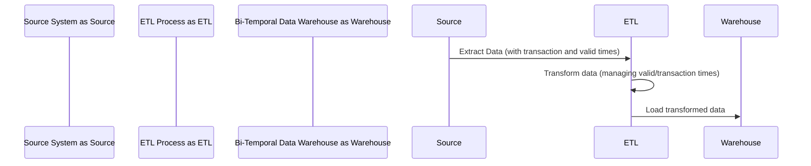

---

linkTitle: "Temporal ETL Processes"
title: "Temporal ETL Processes"
category: "Bi-Temporal Data Warehouses"
series: "Data Modeling Design Patterns"
description: "Extract, Transform, Load processes designed to handle bi-temporal data, managing both valid and transaction times consistently."
categories:
- Data Warehousing
- ETL Processes
- Data Modeling
tags:
- Bi-Temporal
- ETL
- Data Warehousing
- Data Consistency
- Temporal Data
date: 2024-07-07
type: docs

canonical: "https://softwarepatternslexicon.com/103/12/4"
license: "© 2024 Tokenizer Inc. CC BY-NC-SA 4.0"
---

Temporal ETL Processes involve designing ETL mechanisms that effectively handle bi-temporal data to maintain consistency with both valid and transaction times. This pattern addresses the need for historical accuracy and ensures that change management within a data warehouse is fluid and precise.

## Detailed Explanation

In conventional ETL processes, data is often only captured based on when it is recorded (transaction time) rather than when it is truly effective (valid time). Bi-temporal databases allow users to capture both these dimensions, aiding in more robust and versatile time analyses.

### Key Concepts:
- **Valid Time**: The period during which a piece of data is considered accurate in the real world. This could correspond to the effective duration of a contract or asset.
- **Transaction Time**: The time when the data is stored in the database system, ensuring a complete history of database changes is kept for auditing purposes.

### Architectural Approach

1. **Data Extraction**: From source systems, data combined with both its transaction time and valid time is extracted. This might require access to metadata or supplemental databases where the historical context is maintained.

2. **Data Transformation**: During transformation, maintain both time dimensions. This involves transforming datasets to keep them synchronized with their corresponding temporal fields. Logic must ensure congruency with destination schema that supports bitemporality.

3. **Data Loading**: Load transformed data into bi-temporal data warehouses. Consider using Upserts (update/insert) to efficiently handle data updates while maintaining historical states.

### Best Practices

- **Use of Slowly Changing Dimensions (SCD)**: Incorporate SCD Type 2 attributes, which maintain historical data by creating additional records for changed data, in conjunction with bi-temporal fields.
- **Schema Design**: Design schemas with both valid and transaction time attributes and use indexing to facilitate efficient temporal querying.
- **Consistent Auditing**: Establish comprehensive auditing mechanisms to track changes in both transaction and valid time dimensions.

### Example Code

Below is an example in Scala using a functional approach to handle DataFrame transformations:

```scala
import org.apache.spark.sql.{DataFrame, SparkSession}
import org.apache.spark.sql.functions._

object TemporalETL {
  def transform(df: DataFrame): DataFrame = {
    df.withColumn("effective_start", col("valid_start"))
      .withColumn("effective_end", col("valid_end"))
      .withColumn("record_start", current_timestamp())
      .withColumn("record_end", lit(null))
  }
}

val spark = SparkSession.builder()
    .appName("Temporal ETL")
    .getOrCreate()

val sourceData: DataFrame = spark.read.option("header", "true").csv("source_data.csv")

val transformedData = TemporalETL.transform(sourceData)
transformedData.show()
```

### Diagrams

Here’s a simplified sequence diagram in Mermaid explaining the flow of a Temporal ETL Process:



## Related Patterns

- **Slowly Changing Dimensions**: Efficiently managing data attribute changes over time and maintaining history relevant to the temporal aspect.
- **Snapshot Pattern**: Capturing specific moments of the historical data to allow accurate point-in-time data analysis.

## Additional Resources

- [Temporal Data and Bi-Temporal Modelling](https://example.com/temporal-data)
- [ETL Design Best Practices](https://example.com/etl-best-practices)
- [Data Warehousing in the Age of Big Data](https://example.com/data-warehousing-big-data)

## Summary

Temporal ETL Processes are crucial for modern data warehouses that need to maintain an accurate depiction of historical data changes while supporting temporal analyses. By incorporating both transaction time and valid time, enterprises can conduct more meaningful data analytics while adhering to stringent compliance and auditing requirements. Understanding and implementing this design pattern can greatly enhance the robustness of BI and data mining initiatives.


