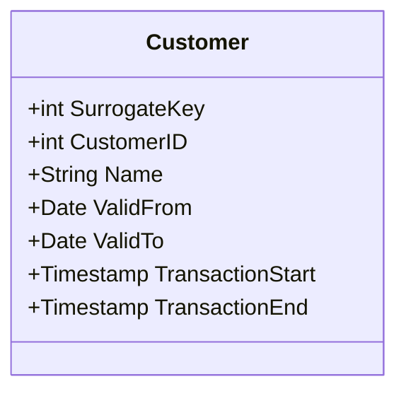

## Introduction

The Bi-Temporal Surrogate Keys design pattern enhances data warehousing capabilities by capturing both system and business time aspects. This pattern aids in efficient querying and precise data tracking over time, catering to complex auditing and data reconciliation needs.

### Purpose

The purpose of using Bi-Temporal Surrogate Keys is to allow for unique identification of dimension records as they evolve over time in both business and system contexts. This approach is especially useful for handling historical data changes without losing accuracy or consistency.

### Components

- **Surrogate Key**: A system-generated unique identifier not derived from business data.
- **Temporal Attributes**: Typically includes `ValidFrom`, `ValidTo`, `TransactionStart`, and `TransactionEnd`.
- **Composite Key**: Combines the surrogate key with temporal attributes to manage multiple versions of a record.

## Architectural Approach

1. **Data Model Design**: Incorporate temporal attributes into dimension tables, designing keys to handle multiple valid periods and transaction scenarios.

2. **Key Management**: Use composite keys encompassing surrogate key, `ValidFrom`, and `TransactionStart`. This approach allows tracking both business validity (e.g., when data is applicable) and system validity (e.g., recorded events).

3. **Data Loading Process**: Implement ETL processes that manage key generation, valid periods, and alter existing records to reflect corrections or new input without overwriting historical data.

4. **Temporal Querying**: Optimize queries to leverage temporal dimensions, supporting retrospective data analysis and comparison of data states across different times.

## Best Practices

- **Key Uniqueness**: Ensure that combinations of surrogate and temporal keys are unique to prevent accidental overwriting of historical data.
- **Granularity of Time**: Carefully select the granularity of temporal fields (e.g., seconds, days) to match business requirements and reduce storage overhead.
- **Efficient ETL Design**: Design ETL processes to minimize latency in updating temporal data and handling concurrent data modifications.

## Example Code

Below is an example schema for a bi-temporal table in SQL:

```sql
CREATE TABLE Customer (
    SurrogateKey SERIAL PRIMARY KEY,
    CustomerID INT NOT NULL,
    Name VARCHAR(255),
    ValidFrom DATE NOT NULL,
    ValidTo DATE,
    TransactionStart TIMESTAMP NOT NULL,
    TransactionEnd TIMESTAMP,
    UNIQUE(CustomerID, ValidFrom, TransactionStart)
);

-- Insert example
INSERT INTO Customer (CustomerID, Name, ValidFrom, ValidTo, TransactionStart, TransactionEnd)
VALUES (1, 'Alice Smith', '2024-01-01', NULL, '2024-07-01 00:00:00', NULL);
```

## Mermaid UML Class Diagram



## Related Patterns

- **Slowly Changing Dimensions (SCD)**: General approach for managing changing dimension data, particularly SCD Type 2 which tracks historical data changes.
- **Temporal Tables**: SQL standard feature that automatically applies system time and aids in managing historical changes over time.

## Additional Resources

- [Type 2 Slowly Changing Dimensions in Data Warehouses](http://example.com/type2SCD)
- [Temporal Table Support in Modern RDBMS](http://example.com/temporalTables)

## Summary

Bi-Temporal Surrogate Keys provide a structured approach for managing data that varies over time due to business and system events. By effectively handling multiple versions of records, this pattern supports complex analysis, audits, and data lineage tasks, essential in maintaining an accurate historical record in bi-temporal data warehouses.
