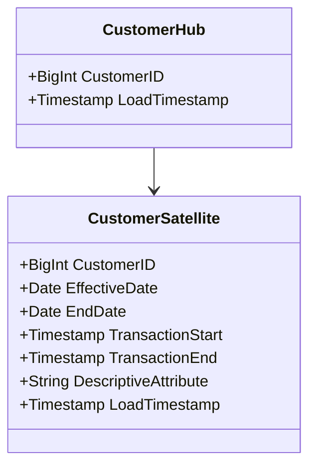
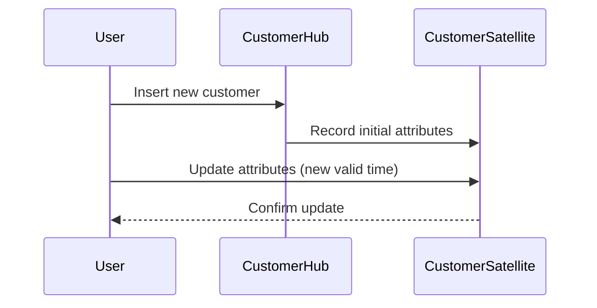

## Introduction to Bi-Temporal Data Vault Modeling

Bi-Temporal Data Vault Modeling extends the Data Vault methodology to accommodate bi-temporal data. This approach allows for capturing both the historical changes and the transaction timing, accommodating two types of time: valid time (business time) and transaction time (system time). By separating these concerns into hubs, links, and satellites with temporal attributes, this technique provides a robust framework for maintaining historical accuracy, auditing changes, and supporting business intelligence operations.

## Architectural Approaches

### Key Concepts

- **Hub**: Represents core business entities identified by unique business keys. In bi-temporal modeling, hubs remain unaffected by time concepts, focusing instead on maintaining the uniqueness and integrity of business keys.
  
- **Link**: Connects hubs, creating relationships between them. Links focus on the unique associations between business entities without incorporating temporal data directly into their structure.
  
- **Satellite**: Stores descriptive attributes related to hubs and links. Satellites capture bi-temporal attributes, representing changes over time. Each satellite table can handle historical data with effective dates (valid time) and record timestamps (transaction time).

### Temporal Attributes in Satellites

- **Valid Time**: The period during which the data is relevant from a business perspective.
- **Transaction Time**: The timestamp indicating when the data was recorded in the database.

### Best Practices

- Design satellites with separate columns for valid and transaction periods to clearly differentiate the timelines.
- Use consistent naming conventions for temporal attributes, e.g., `valid_from`, `valid_to`, `txn_start`, and `txn_end`.
- Implement indexes on temporal columns to optimize historical queries.
- Delineate between changes in valid time (business changes) versus transaction time (system changes) to maintain data integrity.

## Example Code

Below is a conceptual representation using SQL for defining a CustomerHub and its accompanying CustomerSatellite that supports bi-temporal data:

```sql
CREATE TABLE CustomerHub (
    CustomerID BIGINT PRIMARY KEY,  -- Business key
    LoadTimestamp TIMESTAMP NOT NULL
);

CREATE TABLE CustomerSatellite (
    CustomerID BIGINT,
    EffectiveDate DATE,  -- Valid time start
    EndDate DATE,  -- Valid time end
    TransactionStart TIMESTAMP,  -- Transaction time start
    TransactionEnd TIMESTAMP,  -- Transaction time end
    DescriptiveAttribute VARCHAR,
    LoadTimestamp TIMESTAMP NOT NULL,
    PRIMARY KEY (CustomerID, EffectiveDate, TransactionStart)
);
```

## UML Diagrams

### Class Diagram



### Sequence Diagram



## Related Patterns

- **Temporal Tables**: Enriches relational tables with temporal information, focusing solely on storing historical data.
- **Slowly Changing Dimensions**: Manages changes over time within a data warehouse, although typically not accommodating full bi-temporal characteristics.
- **Dimensional Modeling**: Contrast to the more granular approach of Data Vault, dimensional modeling lacks the flexibility suited to highly dynamic temporal requirements.

## Additional Resources

- [Data Vault 2.0: System of Business Intelligence](https://www.datavaultalliance.com)
- [Temporal Data Modeling Techniques](https://www.temporaldataorg.com)

## Summary

Bi-Temporal Data Vault Modeling effectively manages data complexities involving historical awareness and auditability. Through separating entities into hubs, links, and satellites imbued with valid and transaction time attributes, it creates robust infrastructure capable of supporting intricate analytics and tracing historical changes in data. Employing this model within a data warehouse provides resilience and adaptability in capturing the full lifespan and impact of business data.
