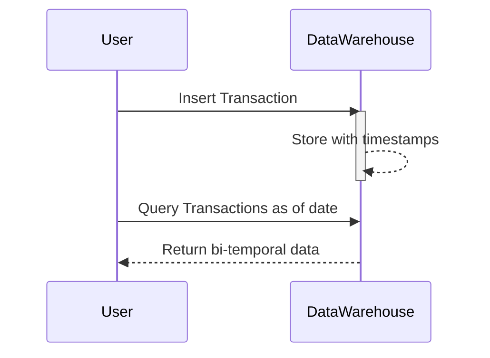

---

linkTitle: "Auditability and Compliance Measures"
title: "Auditability and Compliance Measures"
category: "Bi-Temporal Data Warehouses"
series: "Data Modeling Design Patterns"
description: "Incorporating bi-temporal data to meet regulatory requirements for data retention and auditing."
categories:
- Data Warehousing
- Data Governance
- Regulatory Compliance
tags:
- Bi-Temporal Data
- Audit Trail
- Compliance
- Data Retention
- Financial Regulations
date: 2024-07-07
type: docs

canonical: "https://softwarepatternslexicon.com/103/12/8"
license: "© 2024 Tokenizer Inc. CC BY-NC-SA 4.0"
---

## Introduction

In today's data-centric world, maintaining a detailed history of data changes not only improves data accuracy and relevancy but also ensures compliance with legal and regulatory frameworks. The **Auditability and Compliance Measures** pattern focuses on incorporating bi-temporal data models in data warehouse designs to track changes over time, facilitating auditability and compliance, particularly in highly regulated industries.

## Problem Statement

Organizations face increasing pressure to demonstrate accountability and compliance with various data regulations like the Sarbanes-Oxley Act, GDPR, and HIPAA. This requires robust mechanisms for data retention, audit trails, and traceability. The challenge is to design systems that can efficiently manage historical data while providing accurate temporal querying capabilities.

## Solution

The solution lies in implementing a bi-temporal data model. This approach involves using two temporal dimensions:
- **Transaction Time:** Captures when data changes were recorded in the system.
- **Valid Time:** Represents the actual timeframe during which the data is valid in the real world.

By storing both these temporal properties, organizations can maintain a complete history of data modifications, which is crucial for auditing and compliance purposes.

**Key Components:**
1. **Temporal Tables:** Tables designed to store start and end timestamps for each temporal dimension.
2. **Temporal Queries:** SQL or specialized query operations to retrieve data as of a specific time or period.
3. **Logging and Versioning:** Mechanisms for recording each data modification and its associated metadata.

## Example Implementation

Below is an example SQL schema for a bi-temporal data table in a financial context:

```sql
CREATE TABLE financial_transactions (
    transaction_id SERIAL PRIMARY KEY,
    account_id INT,
    amount DECIMAL(10, 2),
    transaction_date DATE,
    valid_start_time TIMESTAMP,
    valid_end_time TIMESTAMP,
    transaction_start_time TIMESTAMP,
    transaction_end_time TIMESTAMP
);
```

### Example Query

Retrieve the state of transactions for a specific time in history:

```sql
SELECT * FROM financial_transactions
WHERE (valid_start_time <= '2023-01-01' AND valid_end_time > '2023-01-01')
AND (transaction_start_time <= '2023-06-01' AND transaction_end_time > '2023-06-01');
```

## Diagram

The following Mermaid UML diagram represents a simple sequence demonstrating how data changes are recorded and queried in a bi-temporal system.



## Related Patterns

- **Slowly Changing Dimensions (SCD):** Techniques for managing changes in dimensions that occur over time in data warehousing.
- **Event Sourcing:** Capturing all changes to an application state as a sequence of events.

## Additional Resources

- [Temporal Data in SQL: Queries and Concepts](https://example.com/sql-temporal-data)
- [Data Warehousing for Regulatory Compliance](https://example.com/data-warehouse-compliance)
- [Bi-Temporal Data Management Techniques](https://example.com/bi-temporal-data-management)

## Conclusion

Implementing the Auditability and Compliance Measures pattern with bi-temporal data platforms provides a comprehensive solution for tracking data changes and ensuring compliance. By capturing both valid and transaction times, organizations can satisfy regulatory requirements, facilitate audits, and maintain accurate historical data records.
