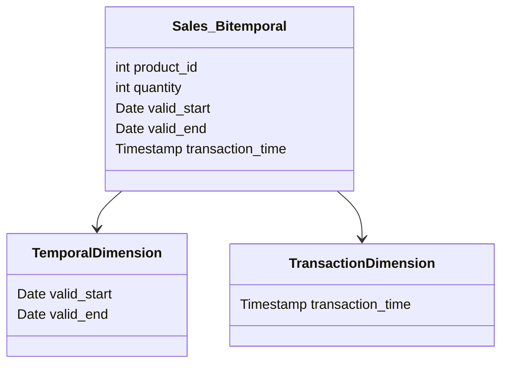

Bi-temporal OLAP cubes are a sophisticated data modeling technique used to enhance analytical capabilities over temporal data. This pattern allows for real-time insights by accommodating both *transaction time* (the time at which data was stored in the system) and *valid time* (the time period during which data is true in the real world) in OLAP (Online Analytical Processing) systems. By representing these two time dimensions, organizations can perform complex analyses to track historical records and understand data changes over time.

## Design Pattern Details

### Architectural Approaches

In this design pattern, OLAP cubes are designed to incorporate bi-temporal dimensions. This involves:

1. **Data Layer Configuration:**
   - Ensure the data source systems capture both transaction and valid time.
   - Extract, Transform, Load (ETL) processes need to be modified to retain and correctly map these timestamps.

2. **Meta Data Management:**
   - Add metadata for data versioning to ensure each transaction's timeframe is captured distinctively.

3. **Cube Design:**
   - Incorporate two time dimensions in the cube schema. A common approach is to extend existing time dimensions or build separate dimensions for transaction and valid time.

4. **Query Execution and Optimization:**
   - Modify query execution engines to accommodate bitemporal queries, ensuring aggregation, filtering, and navigation recognize both dimensions effectively.

### Paradigms

- **Temporal Data Modeling:** Integrating valid and transaction times allows for querying historic and current data differently.
- **Schema Design:** Typically uses a star or snowflake schema with additional dimension tables for temporal aspects.

### Best Practices

- Maintain consistency between transaction data history and current reporting by regularly updating ETL scripts.
- Use indexing strategies to boost performance for time-based queries.
- Invest in automated testing environments to validate the accuracy of projections based on both time dimensions.

### Example Code

Here's a simplified example in SQL illustrating how to capture both valid and transaction time dimensions:

```sql
CREATE TABLE sales_bitemporal (
    product_id INT,
    quantity INT,
    valid_start DATE,
    valid_end DATE,
    transaction_time TIMESTAMP,
    PRIMARY KEY(product_id, valid_start, transaction_time)
);

-- Insert example data
INSERT INTO sales_bitemporal (product_id, quantity, valid_start, valid_end, transaction_time)
VALUES
(101, 30, '2024-06-01', '9999-12-31', CURRENT_TIMESTAMP);
```

### Diagrams



### Related Patterns

- **Slowly Changing Dimension (SCD):** Techniques for managing changing data over time but limited to one aspect of time.
- **Time-Series Storage Pattern:** Analyzing data based on just one time dimension, commonly using TSDBs or similar.

### Additional Resources

- Kimball, R. "The Data Warehouse Toolkit: The Definitive Guide to Dimensional Modeling." (Book)
- "Temporal Data & the Relational Model", by Ben-David, T. (Book)

## Summary

Bi-temporal OLAP cubes provide a powerful mechanism for capturing and analyzing data that varies over time in both the realms it represents and the systems it flows through. By augmenting traditional OLAP designs with dual time tracing, we gain a nuanced understanding of both the factual and reported states over time, equipping decision-makers with precise insights tailored to any moment they wish to explore. This approach significantly strengthens predictive analysis, historical data archiving, and compliance auditing.
