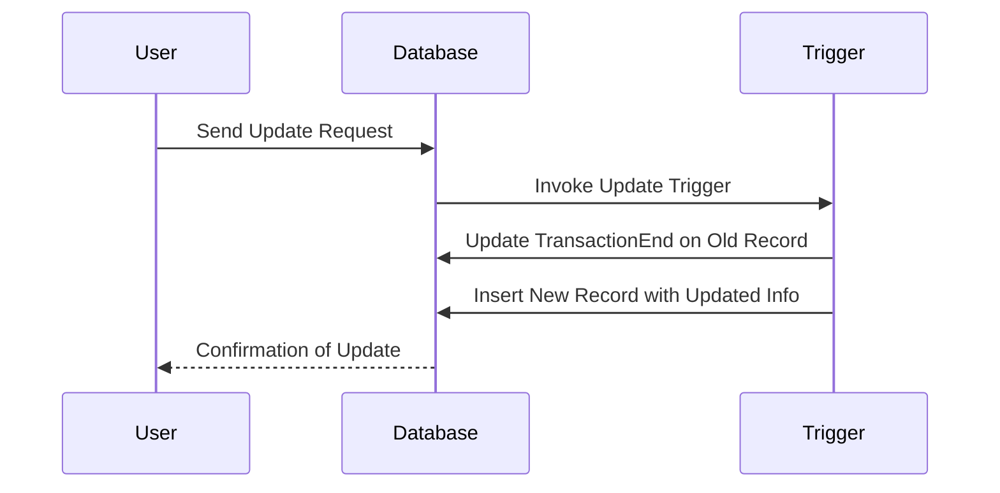

## Bi-Temporal Triggers

### Description

The Bi-Temporal Triggers pattern is a design pattern used in bitemporal data modeling to ensure the integrity and consistency of temporal attributes in a database. This pattern leverages database triggers to automate the management of temporal dimensions, such as transaction time and valid time, upon data changes. Common operations managed via these triggers include setting attributes like `TransactionEnd` when a record is updated and ensuring accurate snapshots of data history.

### Architectural Approach

Bi-temporal databases record both valid time (the period during which a fact is true in the real world) and transaction time (the period during which a fact is stored in the database). Implementing such a system necessitates robust management of data changes with respect to these temporal dimensions:

- **Triggers for Insert Operations**: When new data is inserted into a bitemporal table, triggers are used to set default values for both valid time and transaction time if not explicitly provided. This helps maintain the accuracy of historical records.

- **Triggers for Update Operations**: For updates, triggers can automatically adjust the `TransactionEnd` field of the old record, thereby marking the end of the valid transaction period and initiating a new record with updated information.

- **Triggers for Delete Operations**: Soft deletion can be implemented through triggers by marking the `TransactionEnd` time instead of physically removing the record, thus preserving historical data.

### Best Practices

1. **Granular Transactions**: Ensure transactions are designed to handle complex interrelated updates to maintain the database in a state that allows consistent historical retrievals.
   
2. **Performance Considerations**: Utilize indexing and efficient trigger logic to minimize overhead and ensure that performance remains optimal, especially in high-frequency transaction environments.
   
3. **Testing and Auditing**: Implement comprehensive testing strategies for triggers to ensure they perform correct temporal management and track changes accurately for audit purposes.

### Example Code

Here is an example of a trigger definition for managing bitemporal updates in PostgreSQL:

```sql
CREATE OR REPLACE FUNCTION update_temporal_trigger() RETURNS TRIGGER AS 
BEGIN
  -- When a row is updated, set the TransactionEnd of the old version
  IF TG_OP = 'UPDATE' THEN
    NEW.TransactionStart = CURRENT_TIMESTAMP;
    OLD.TransactionEnd = CURRENT_TIMESTAMP;
    -- Insert historical data into an archive table if desired
    INSERT INTO historical_table SELECT OLD.*;
    RETURN NEW;
  END IF;
  RETURN NULL;
END;
 LANGUAGE plpgsql;

CREATE TRIGGER update_temporal
BEFORE UPDATE ON bitemporal_table
FOR EACH ROW EXECUTE FUNCTION update_temporal_trigger();
```

### Diagrams

Below is a sequence diagram illustrating the flow when a data update occurs:



### Related Patterns

- **Bi-Temporal Tables**: The foundational pattern related to organizing time-related data dimensions within tables.
- **Soft Deletion Pattern**: A design pattern used alongside triggers to manage logical deletions without loss of historical data.

### Additional Resources

- [Temporal Data & the Relational Model](https://books.example.com)
- [PostgreSQL Trigger Documentation](https://www.postgresql.org/docs/current/plpgsql-trigger.html)
- [Temporal Table Design Patterns](https://patterns.example.com)

### Summary

Bi-Temporal Triggers provide an automated means to ensure data integrity and historical accuracy by managing temporal attributes in bitemporal databases. By employing well-conceived triggers, organizations can effortlessly maintain a complete history of changes while reducing manual intervention, enhancing both data quality and reliability. As the importance of temporal data continues to grow, implementing such patterns becomes crucial in systems that need to maintain comprehensive time-based insights.
