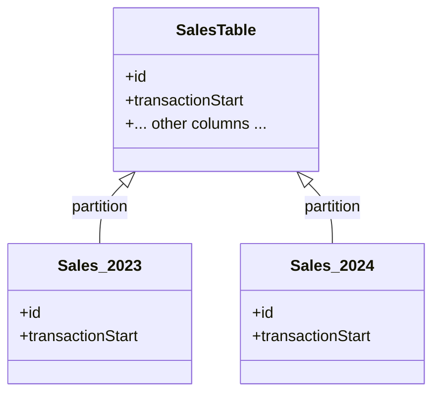

---

linkTitle: "Temporal Data Partitioning"
title: "Temporal Data Partitioning"
category: "Bitemporal Tables"
series: "Data Modeling Design Patterns"
description: "An effective data modeling strategy that involves splitting large tables into more manageable partitions using temporal data such as timestamps or dates. This design pattern enhances performance and scalability, making queries and data management more efficient."
categories:
- Bitemporal Modeling
- Data Partitioning
- Database Design
tags:
- Data Modeling
- Temporal Tables
- Partitioning
- Big Data
- Scalability
date: 2024-07-07
type: docs

canonical: "https://softwarepatternslexicon.com/103/2/12"
license: "© 2024 Tokenizer Inc. CC BY-NC-SA 4.0"
---

### Introduction

**Temporal Data Partitioning** is a design pattern utilized in database systems to organize and manage large datasets in more efficient ways by leveraging temporal data such as timestamps or dates. A common practice within bitemporal tables, this method involves splitting tables into partitions based on temporal criteria, thereby enhancing data retrieval performance and simplifying management. Especially under big data environments, temporal data partitioning is a key technique to ensure systems can handle and process vast amounts of data efficiently.

### Problem Addressed

In database systems, handling large volumes of data can result in slow query performance, increased storage requirements, and complex maintenance operations. When extensive data spans over multiple years or even decades, simple operations can become resource-intensive. The lack of efficient data organization can lead to increased costs and can potentially hinder business insights.

### Solution Overview

Temporal Data Partitioning solves these issues by dividing the data into smaller, easily manageable partitions based on temporal criteria, such as transaction start or end dates. This segregation helps maximize the effectiveness of key database operations, including querying, indexing, and performing backups, which are subsequently streamlined to smaller, relevant datasets. For example, partitioning a sales table by the `TransactionStart` year enables queries scoped within specific time frames to only scan necessary partitions, resulting in significantly improved performance.

### Implementation Steps

1. **Identify Temporal Data Columns**: Determine significant date or timestamp columns that represent the natural divisions in your data (e.g., `TransactionStart`, `CreatedDate`).
   
2. **Define Partition Strategy**: Decide how to segment your table, such as by year, quarter, or month, depending on the granularity of data access patterns.

3. **Create Partitions**: Use SQL partitioning features offered by your database system (e.g., PostgreSQL, Oracle, or partition-specific Big Data tools like Apache Hive) to define and implement the partitions.

```sql
-- Example: Partition a sales table by TransactionStart year
CREATE TABLE sales (
    id SERIAL,
    transactionStart DATE,
    -- other columns
)
PARTITION BY RANGE (EXTRACT(YEAR FROM transactionStart));

CREATE TABLE sales_2023 PARTITION OF sales
FOR VALUES FROM (2023) TO (2024);
-- Repeat for other years
```

4. **Maintain Partitions**: Implement procedures for creating new partitions and possibly removing old ones as needed for business logic and system constraints.

### Architectural Diagram

Here is a Mermaid diagram illustrating the partitioning design:



### Best Practices

- **Optimize Partition Size**: Ensure partitions are neither too large (which limits efficiency gains) nor too small (causing overhead).
  
- **Automate Partition Management**: Automate the creation of new partitions to coincide with new data entry points and consistently retire old data partitions.

- **Index Partitions Appropriately**: Use indexes within partitions to quicken query execution times further meeting business needs.

### Related Patterns

- **Schema Versioning**: Ensuring database schema compatibility with time-variant or evolving datasets.
- **Sharding**: Distributing data across multiple database instances, potentially in conjunction with partitioning for horizontal scaling.
- **Data Lake Patterns**: Using temporal and other partitioning strategies in unstructured data storage environments.

### Additional Resources

- [PostgreSQL Partitioning Documentation](https://www.postgresql.org/docs/current/ddl-partitioning.html)
- [Oracle Partitioning Documentation](https://docs.oracle.com/en/database/oracle/oracle-database/21/vldml/partitioning.html)
- "Designing Data-Intensive Applications" by Martin Kleppmann for more on data modeling patterns.

### Final Summary

Temporal Data Partitioning offers significant performance and manageability improvements for databases handling large volumes of time-based records. By dividing data into temporal-based partitions, organizations gain streamlined access to data, enhanced query performance, and improved scalability—all crucial for maintaining robust, high-performing data systems. This pattern sits well with other data management strategies, forming a core element of high-scale database systems' architecture.
