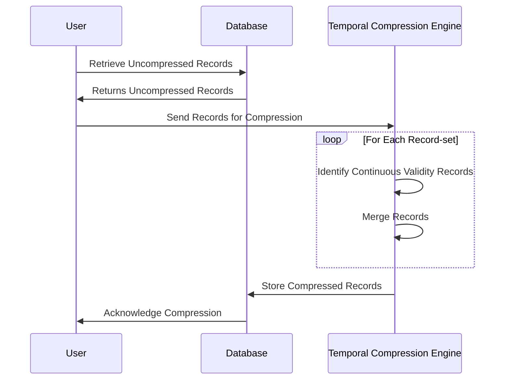

## Temporal Data Compression

Temporal Data Compression is a design pattern focused on reducing data storage requirements by consolidating records within bitemporal tables where the validity timeframe is continuous, and the data remains identical. This approach is especially useful in scenarios where data tracked over time, such as financial records or personnel data changes, often include prolonged intervals with no changes in values.

### Description

In bitemporal databases, each piece of data is associated with two timeline dimensions: valid time (when data is actually valid) and transaction time (when data is stored). Temporal Data Compression targets redundancy by combining consecutive records that share identical data across continuous validity periods, reducing both storage usage and complexity of data retrieval.

### Example Use Case

Consider an employee salary record strategy in a human resources database. If an employee's salary remains unchanged for several consecutive periods but is stored as separate records, it could consume unnecessary storage and contribute to inefficiency. Temporal Data Compression combines these records into a single entry with an adjusted validity period, reflecting the entire duration of unchanged salary.

```sql
-- Consider the initial salary records table
CREATE TABLE EmployeeSalary (
    EmployeeID INT,
    Salary DECIMAL(12, 2),
    ValidFrom DATE,
    ValidTo DATE
);

-- Before compression
INSERT INTO EmployeeSalary VALUES (1, 50000, '2022-01-01', '2022-06-30');
INSERT INTO EmployeeSalary VALUES (1, 50000, '2022-07-01', '2022-12-31');
-- .... similar entries for continuous periods

-- After applying Temporal Data Compression
-- Merged when the salary remains the same
INSERT INTO EmployeeSalaryCompressed VALUES (1, 50000, '2022-01-01', '2022-12-31');
```

### Approach and Implementation

1. **Identify Candidates for Compression**: Locate records with identical data values and check their valid time overlap.
2. **Merge Continuous Records**: Combine such records to extend the validity period without altering the transaction time.
3. **Apply Iteratively**: Use iterative or batch processing to compress applicable records, particularly during low-use periods to minimize impact on system performance.
4. **Maintain Data Integrity**: Ensure the original semantic meaning and time-validity of data are preserved.

### Diagrams

The below Mermaid sequential diagram illustrates how Temporal Data Compression can be applied to reduce redundancy in a set of records:



### Related Patterns

- **Bitemporal Data Management**: Utilizes dual timelines to manage temporal data changes comprehensively.
- **Data Deduplication**: General pattern for eliminating duplicate data entries to optimize storage.

### Additional Resources

- *Temporal Data Management* by Snodgrass, R. (Book)
- Online databases and tutorials on managing bitemporal tables.

### Summary

Temporal Data Compression is an efficient design pattern to optimize storage use in databases leveraging temporal aspects. By consolidating redundant records sharing continuous valid timeframes, it reduces storage while retaining data integrity. This is particularly beneficial in databases with a temporal factor where data changes are infrequent. Using this pattern effectively ensures optimal data footprint and facilitates efficient data retrieval and management processes in bitemporal scenarios.
