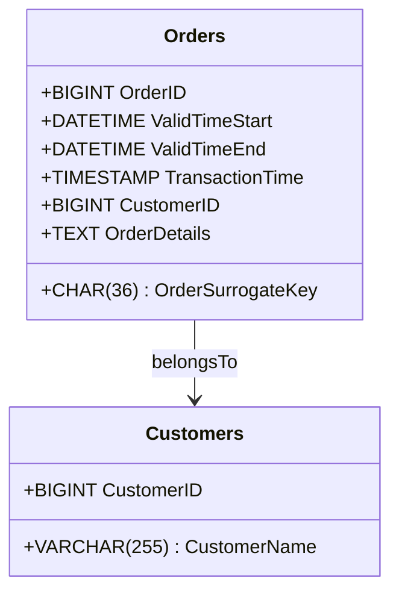

## Temporal Surrogate Key Strategy

### Description

The Temporal Surrogate Key Strategy is a design pattern used in data modeling to generate unique keys that not only ensure entity uniqueness but also encapsulate temporal aspects of the data. This strategy is particularly essential in databases dealing with bitemporal data, where preserving the history of data changes over both transaction and valid times is crucial.

### Architectural Approach

Incorporating temporal elements into surrogate keys typically involves creating composite keys that combine a traditional surrogate key, such as an auto-incremented integer, with additional temporal components. These components might include:

- **Transaction Time**: Captures the time a record was stored in the database.
- **Valid Time**: Captures the time during which a record is true in the real world.
  
By leveraging a composite of these elements, databases can maintain robust data integrity and ensure accurate temporal querying.

### Paradigms and Best Practices

- **Normalization vs. Denormalization**: Decide the level of normalization based on access patterns and performance requirements. Temporal surrogate keys often fare better in denormalized tables within a warehouse system.
  
- **Granular Temporal Control**: Facilitate fine-grained control of transaction and valid times for complex queries about past, present, or simulated future states of data.

- **Indexing**: Consider indexing the temporal components for quicker retrieval of time-specific data.

### Example Code

Here is an example of how such a table might be defined in SQL:

```sql
CREATE TABLE Orders (
    OrderID BIGINT AUTO_INCREMENT PRIMARY KEY,
    OrderSurrogateKey CHAR(36) NOT NULL,
    ValidTimeStart DATETIME,
    ValidTimeEnd DATETIME,
    TransactionTime TIMESTAMP DEFAULT CURRENT_TIMESTAMP,
    CustomerID BIGINT,
    OrderDetails TEXT
);

INSERT INTO Orders 
(OrderSurrogateKey, ValidTimeStart, ValidTimeEnd, CustomerID, OrderDetails)
VALUES 
(UUID(), '2023-10-01 00:00:00', '9999-12-31 23:59:59', 1, 'Order detail data');
```

### Diagram

Here is a UML Class diagram using Mermaid to illustrate the relationship:



### Related Patterns

- **Snapshot Pattern**: Captures the state of a record at a given point in time for auditing and temporal comparisons.
  
- **Temporal Pattern**: Provides mechanisms to query historical versions of records as they were at any specified time.

### Additional Resources

1. *"Temporal Databases: Design and Implementation"* by C. Date
2. *"Temporal Data & the Relational Model"* by C.J. Date, Hugh Darwen, Nikos A. Lorentzos
3. [Bitemporal Modeling Concepts](https://www.oodesign.com/bitemporal-modeling.html)

### Summary

The Temporal Surrogate Key Strategy is essential in scenarios that require detailed historical analysis and auditing capabilities. By extending traditional surrogate keys with temporal information, it provides a comprehensive approach to manage and query bitemporal data. Design considerations such as indexing, normalization, and careful management of temporal elements enhance the robustness of this strategy within complex data systems.
