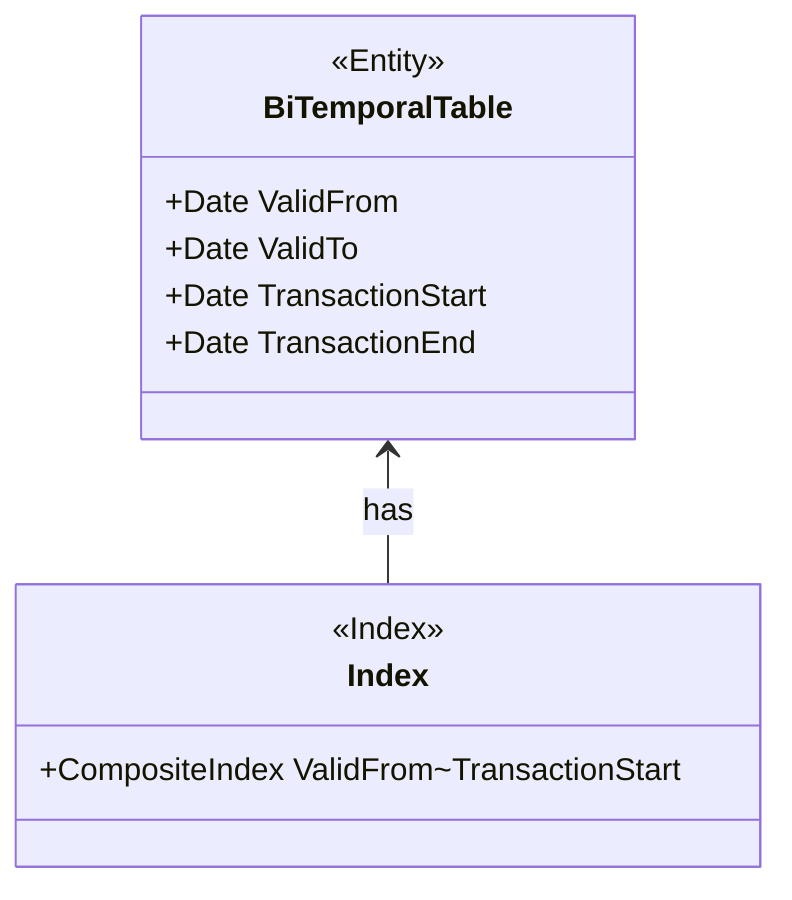

The advent of bi-temporal tables addresses the need to manage historical data effectively, accommodating both actual historical data (`Valid Time`) and the recording of information history (`Transaction Time`). In such databases, high-efficiency querying becomes crucial. This is where bi-temporal indexing strategies play a fundamental role.

## Description

Bi-temporal indexing strategies focus on optimizing indexes for queries that involve both transaction and valid time dimensions. This is essential in applications where both the history of the data and the timeline of transaction events are important.

A well-planned indexing approach is critical to efficiently handle various queries, enhance performance, and reduce the cost of data retrieval in databases encompassing temporal data dimensions.

## Design Pattern Intent

The main objective is to facilitate:
- Fast access to temporal data.
- Supporting complex temporal queries efficiently.
- Enhancing performance regarding data retrieval operations.

## Structure

Bi-temporal indexing involves creating composite indexes, typically on the primary table columns that represent temporal data, like `ValidFrom`, `ValidTo`, and `TransactionStart`, `TransactionEnd`. These indexes will help in speeding up the retrieval of data for particular temporal queries.

## Paradigms and Architectural Approaches

- **Composite Indexes**: Developing indexes that combine attributes from both transaction and valid time, which helps optimize the performance for a wide range of queries.
- **Covering Indexes**: These can include non-temporal columns that are typically retrieved alongside temporal data, preventing the need for additional lookups.
- **Range-Based Indexing**: Helps in handling queries that involve date ranges, improving the access speed for temporal intervals.

## Best Practices

- **Selective Indexing**: Only index columns that are frequently subjected to filtering in temporal queries to optimize storage and performance.
- **Index Maintenance**: Regular update and optimization of indexes ensure they remain efficient, especially when dealing with very large, continuously updating datasets.
- **Monitoring Query Patterns**: Regularly run query analysis to determine shifting usage patterns which may indicate the need for index changes.  

## Example Code

In SQL-like syntax, creating a composite index can be achieved as follows:

```sql
CREATE INDEX idx_bitemporal_valid_transaction
ON BiTemporalTable (ValidFrom, TransactionStart);
```

This example shows the creation of a composite index on a bi-temporal table, promoting quick access for queries using combinations of `ValidFrom` and `TransactionStart`.

## Diagram

Below is a simple class diagram representing bi-temporal indexing structure:



This diagram shows how a bi-temporal table may define a composite index strategy reflecting both validity and transaction timelines.

## Related Patterns

- **Temporal Query Optimization**: Enhances querying performance through optimized SQL query constructions.
- **Historical Data Management**: Captures data changes over time to maintain historical states effectively.
- **Composite Key Design**: Used for uniquely identifying rows in multi-column tables heavily used by bi-temporal tables.

## Additional Resources

- [Martin Fowler's Patterns of Enterprise Application Architecture](https://martinfowler.com/)
- [Effective Database Design for Temporal Data](https://www.sqlservercentral.com/)
- [Temporal Table Design Using SQL](https://docs.microsoft.com/)

## Summary

Bi-temporal indexing strategies are essential for optimizing the performance of temporal queries in bi-temporal databases. By applying appropriate composite, covering, and range-based indexing techniques, you significantly enhance data retrieval operations' efficiency, ensure scalability, and maintain data accuracy throughout its lifecycle. Consider regularly revisiting your indexing strategies to align with shifting data usage patterns.

These strategies enable organizations to manage complex historical data scenarios effectively, thereby supporting accurate past and present data analysis and reporting needs.
