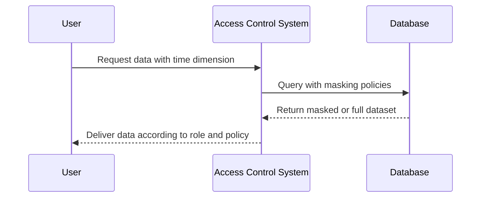

Temporal Data Masking is a specialized design pattern aimed at safeguarding sensitive data by applying masking policies over time in databases that utilize temporal or bitemporal tables. This approach is crucial for scenarios where historical data may contain sensitive information that should not be exposed to certain users or systems due to confidentiality and compliance requirements.

## Explanation

In the context of database management, bitemporal tables maintain two dimensions of time for every data record — transaction time and valid time:

- **Transaction Time**: Represents when a record is stored in the database.
- **Valid Time**: Represents the real-world effective time frame for which the data is accurate.

Temporal Data Masking employs access control similar to data masking techniques, but with a temporal consideration, thus restricting visibility over specific periods or for specific temporal dimensions (like past, present, or future data).

### Architectural Approach

1. **Policy Definition**: Define masking policies based on organizational requirements. Policies may include which data elements need to be masked, for whom, and during which time periods.

2. **Access Control Framework**: Implement an access control framework that assesses user roles, permissions, and the context of the data request (e.g., current user, intended use, and time dimension).

3. **Data Masking Techniques**: Apply various techniques such as substituting, shuffling, or obscuring sensitive data fields while storing the original data securely.

4. **Logging and Auditing**: Maintain logs for all masked data access for auditing purposes. This helps in tracking data usage and ensuring that policies are being enforced properly.

5. **Performance Considerations**: Optimize the masking process so it can handle complex queries without degrading system performance.

### Example Code

Here's a conceptual implementation using SQL-based pseudocode to illustrate how temporal data masking might work.

```sql
CREATE TABLE EmployeeHistory
(
    EmployeeID INT,
    Name VARCHAR(100),
    Salary INT,
    ValidTime PERIOD(DATE) AS ROW(past_start_date, past_end_date),
    TransactionTime PERIOD(TIMESTAMP) AS ROW(trans_start_ts, trans_end_ts),
    CONSTRAINT EmployeeHistory_PK PRIMARY KEY (EmployeeID, ValidTime WITHOUT OVERLAPS)
);
 
CREATE VIEW MaskedEmployeeHistory AS
SELECT
    EmployeeID,
    Name,
    -- Mask salary based on user role and access time
    CASE 
       WHEN CURRENT_ROLE() IN ('HR', 'FINANCE') THEN Salary
       WHEN CURRENT_DATE > past_end_date THEN NULL -- Hide past salary
       ELSE 'MASKED' -- Default masking for others
    END as Salary,
    ValidTime
FROM EmployeeHistory
WHERE TransactionTime CONTAINS CURRENT_TIMESTAMP;
```

### Diagrams

Here is a UML sequence diagram showcasing the interaction between User, Access Control System, and Database for applying Temporal Data Masking:



### Related Patterns

- **Role-Based Access Control (RBAC)**: Integrating this pattern closely complements Temporal Data Masking for dynamically altering data views based on user roles.
- **Data Obfuscation**: A broader category including various techniques for altering data to protect its actual value.
- **Audit Logging**: Log and monitor accesses to sensitive data to maintain transparency and compliance.

### Additional Resources

- [Temporal Database Concepts and Applications](https://example.com/temporal-database-concepts)
- [Data Masking Techniques for Privacy Protection](https://example.com/data-masking-techniques)
- [Bitemporal Tables: Essentials and Use Cases](https://example.com/bitemporal-tables-essentials)

## Summary

Temporal Data Masking provides a robust framework for managing sensitive data access across time dimensions, especially in environments with rich historical data needs. By implementing policies that align with organizational data protection goals, this pattern safeguards against unauthorized data exposure while maintaining compliance with legal and security regulations. Integrating with existing role-based access systems, it provides a powerful toolset for handling complex data sensitivity needs within modern and legacy systems.
