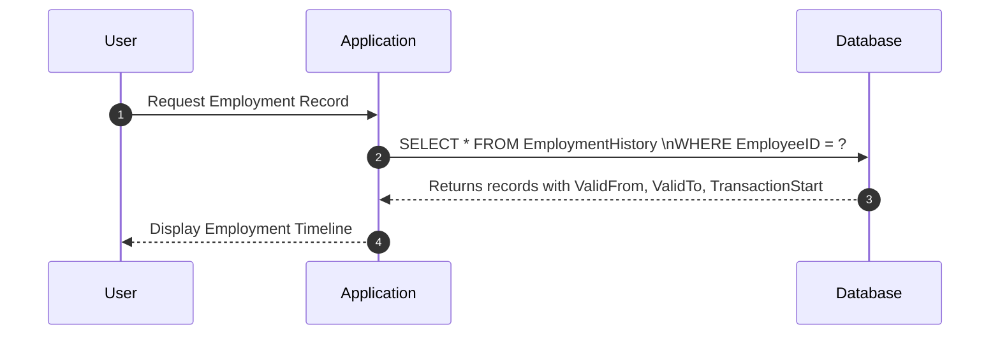

---

linkTitle: "Composite Primary Keys Including Temporal Columns"
title: "Composite Primary Keys Including Temporal Columns"
category: "Bitemporal Tables"
series: "Data Modeling Design Patterns"
description: "Utilize composite primary keys, combining business keys with temporal attributes, to uniquely identify records in bitemporal tables, ensuring accurate historical and transactional data capture."
categories:
- Data Modeling
- Database Design
- Temporal Tables
tags:
- Bitemporal
- Composite Keys
- Data Modeling
- Database Design
- Temporal Data
date: 2024-07-07
type: docs
canonical: "https://softwarepatternslexicon.com/103/2/2"
license: "© 2024 Tokenizer Inc. CC BY-NC-SA 4.0"
---

## Introduction

In the realm of bitemporal database design, it is often essential to uniquely identify each record based not only on a business key but also on the specific temporal attributes. This design pattern, Composite Primary Keys Including Temporal Columns, addresses the need to record both historical and transactional timelines, ensuring that every temporal state of a data entity is accurately and unequivocally captured.

## Explanation

### Design Pattern Overview

The design pattern involves using composite keys that include:

- **Business Key(s):** The natural key(s) that identify the business entity (e.g., `EmployeeID`).
- **Temporal Columns:** These can typically include:
  - `ValidFrom` and `ValidTo`: Representing the valid time during which the data reflects the reality of the modeled world concerning this business key.
  - `TransactionStart` and `TransactionEnd`: Denoting the transaction time for when the data was stored and valid within the database.

### Architectural Approach

1. **Normalization Strategy**: The introduction of temporal attributes alongside business keys helps move from simpler 1NF schemas to more nuanced and informative 2NF and 3NF schemas by capturing changes accurately.

2. **Temporal Table Design**: Tables using this pattern will tend to be historical tables, audit logs, or transactional history repositories, often part of a temporal database system.

3. **Increased Read Complexity**: When utilizing these tables, queries often require additional complexity, leveraging BETWEEN conditions for temporal validity checks.

### Example Code

Here's a simple representation of creating such a table in SQL:

```sql
CREATE TABLE EmploymentHistory (
    EmployeeID INT,
    ValidFrom DATETIME,
    ValidTo DATETIME,
    TransactionStart DATETIME,
    Department VARCHAR(50),
    Role VARCHAR(50),
    PRIMARY KEY (EmployeeID, ValidFrom, TransactionStart)
);
```

### Best Practices

- **Ensure Temporal Accuracy**: Always maintain precision in capturing both valid and transaction times, preferably using high-precision timestamps.
- **Consistent Primary Key Structure**: Adhere to the composite key structure across tables that require both business and temporal identifiers.
- **Efficient Indexing**: Consider indexing temporal columns separately to optimize query performance on temporal ranges.

### Diagrams

The following Mermaid UML sequence diagram illustrates a simple data retrieval using bitemporal data:



### Related Patterns

- **Slowly Changing Dimension (SCD)**: This pattern deals with capturing changes in slowly changing dimensions, particularly in data warehouses.
- **Auditing Table Design**: Focuses on capturing historical changes over time, often utilizing temporal columns.
- **Temporal Validity Patterns**: Engages with ensuring data consistency and integrity over time.

### Additional Resources

For a comprehensive understanding, explore these resources:

- *Temporal Data & The Relational Model* by C. J. Date et al.
- Online resources on the [Temporal Tables](https://docs.microsoft.com/en-us/sql/relational-databases/tables/temporal-tables) feature in Microsoft SQL Server.

## Summary

Composite Primary Keys Including Temporal Columns are fundamental in scenarios demanding detailed historical and real-time analysis. By anchoring business context with time-sensitive details, databases can more precisely represent, query, and act upon temporal data. This pattern plays a pivotal role in sectors like logistics, finance, and HR, where precise data lineage and version control are crucial.
