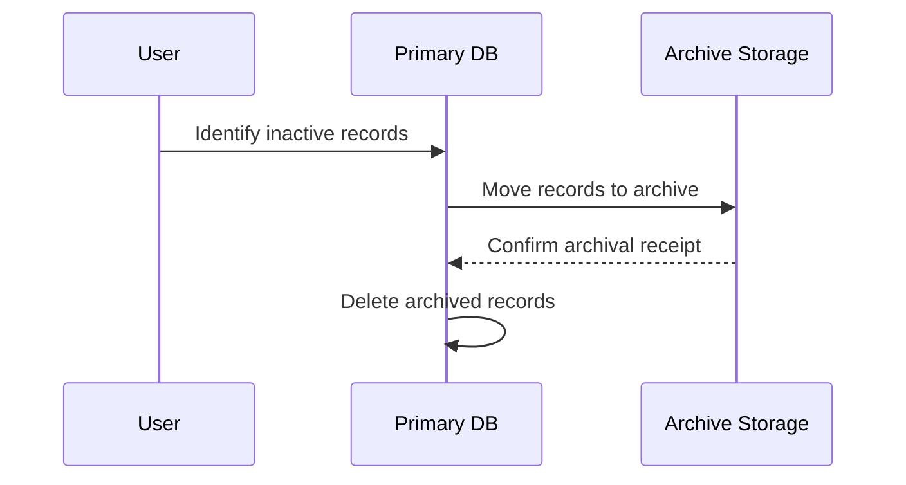

## Description

Temporal Data Archiving is a design pattern used in data systems to systematically move outdated temporal records from the primary database into an archiving system. This pattern helps in maintaining the operational efficiency of the active database while ensuring that historical data is preserved in a cost-effective manner. By separating active data from historical data, organizations can enhance query performance on current datasets and still retain full accessibility to archival data for compliance and analytical purposes.

## Architectural Approach

1. **Data Segmentation**: The primary system segments data based on temporal attributes, identifying which records need to move to an archive.
   
2. **Archiving Mechanism**: Implements mechanisms, possibly automated, to transfer data from primary to secondary storage. This could be through batch processing, scheduled jobs, or triggers.

3. **Storage Solutions**: Archives can leverage cost-effective storage solutions, such as cloud object storage, tape libraries, or specialized cold storage systems that cater to infrequently accessed data.

4. **Data Integrity & Access**: Ensure data integrity with checksums or hashes. Provide structured access for audits or analytics via systems like Snowflake or Apache Iceberg which support temporal queries over historical data.

## Best Practices

- **Define Retention Policies**: Clearly define and document data retention and archival policies. This helps enforce consistency and ensures regulatory compliance.
  
- **Maintain Data Accessibility**: Offer transparent access patterns to archived data, possibly using hybrid databases that make queries across hot, warm, and cold storage seamlessly.
  
- **Automate Archival Processes**: Use cloud-native or traditional ETL solutions to automate archival processes, reducing manual intervention and potential errors.

- **Monitor and Audit**: Implement monitoring for archiving processes and perform regular audits to ensure no critical data is lost and that archiving is performed according to policy.

## Example Code

Here's an example of archiving data in a SQL-based system:

```sql
-- Assume `employees` is the current table and `archived_employees` is the archival table.

-- Move employees who have been inactive for more than 10 years to the archive
INSERT INTO archived_employees SELECT * FROM employees
WHERE last_active_date <= NOW() - INTERVAL '10 years';

-- Delete the archived records from the active table
DELETE FROM employees
WHERE last_active_date <= NOW() - INTERVAL '10 years';
```

## Diagrams

Here is a Mermaid Sequence diagram illustrating the temporal data archiving process:



## Related Patterns

- **Bitemporal Data Pattern**: Extends the concept by adding transaction time in addition to valid time, ensuring every data modification is traceable.
  
- **Command Query Responsibility Segregation (CQRS)**: Helps by separating read and write models, potentially using archived data in read operations.

- **Log-Based Data Management**: Uses distributed logs (e.g., Apache Kafka) as a repository for streamed archiving of historical records.

## Additional Resources

- [Temporal Table Definitions in SQL](https://docs.microsoft.com/en-us/sql/relational-databases/tables/temporal-tables?view=sql-server-ver15)
- [Archiving Best Practices](https://www.ibm.com/docs/en/db2)

## Summary

Temporal Data Archiving provides a robust framework for managing and preserving historical data while optimizing operational databases' performance. Adopting this pattern helps businesses comply with legal mandates, improve data accessibility, and reduce storage costs by effectively leveraging both active and archival storage infrastructures.
