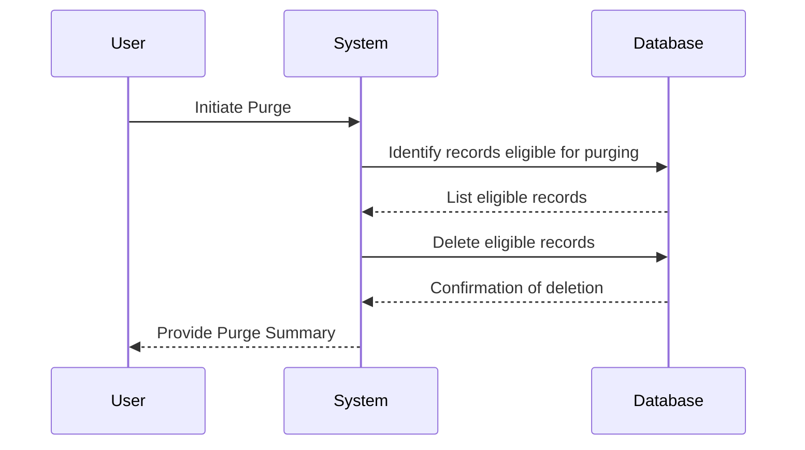
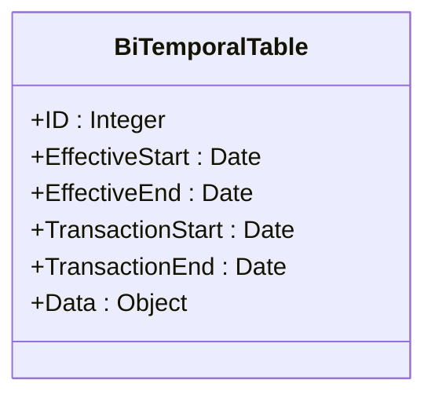

## Introduction

Bi-Temporal Data Purging is a critical design pattern for managing and maintaining bi-temporal tables, ensuring efficient storage and data integrity over time. Bi-temporal data involves two dimensions of time: the **valid time**, when the data is actual, and the **transaction time**, when the data is stored within the database. Maintaining this data can become cumbersome without a proper strategy for data purging. This pattern focuses on implementing systematic data purging practices for bitemporal tables, based on various temporal criteria such as data retention policies.

## Design Pattern Explanation

### Architectural Approaches

In bi-temporal databases, records are maintained with validity and transaction time dimensions, making purging complex as it necessitates consideration of both time axes. Effective bi-temporal data purging should:

1. **Identify Purge Criteria**: Define clear criteria, typically around retention periods for transaction and/or valid times, to identify obsolete data.
2. **Preserve Data Integrity**: Ensure consistency and integrity of the remaining data, including relationships between records.
3. **Leverage Indexes**: Use temporal indexes efficiently to identify and remove only those records that meet the purge criteria.

### Implementation Steps

1. **Define Purging Policy**: Establish business rules for data purging related to bi-temporal records, e.g., remove records where valid-time is older than 7 years.

2. **Query and Identify Records**: Use SQL queries or other database queries to filter records meeting the criteria. For example:
    ```sql
    DELETE FROM transaction_table
    WHERE valid_end < CURRENT_DATE - INTERVAL '7 years'
    AND transaction_end < CURRENT_DATE - INTERVAL '2 years';
    ```

3. **Automate Purging Process**: Implement scripts or database stored procedures to automatically execute purging at regular intervals.

4. **Backup Before Purging**: Maintain data backups to prevent data loss in case of accidental purging or to comply with audit requirements.

### Example Code

Here is an example to demonstrate deletion from bitemporal tables based on a predefined criterion:

```sql
-- SQL Example of purging old records based upon transaction and valid time
BEGIN;

-- Define retention policy
DECLARE retention_period_valid INTEGER := 7; 
DECLARE retention_period_transaction INTEGER := 2;

-- Purge command for bi-temporal table
DELETE FROM bi_temporal_table
WHERE valid_end < (CURRENT_DATE - INTERVAL retention_period_valid YEAR)
AND transaction_end < (CURRENT_DATE - INTERVAL retention_period_transaction YEAR);

COMMIT;
```

### Diagrams

#### Sequence Diagram - Purging Process



#### UML Class Diagram - Temporal Table Structure



## Related Patterns

- **Versioned Data Pattern:** Focuses on managing historical versions of records while ensuring quick access to the current version.
- **Soft Deletion Pattern:** Mark records as inactive rather than physically deleting for audit trail.

## Best Practices

- Ensure proper indexing on relevant temporal columns to improve query performance.
- Regularly review and refine purge criteria based on business and compliance requirements.
- Consider archiving data instead of purging, ensuring historical data recovery if needed.

## Additional Resources

- *Temporal Databases* by Richard T. Snodgrass for foundational knowledge on handling temporal data.
- Database vendors’ documentation, e.g., Oracle's Temporal SQL and SQL Server’s temporal table features.

## Summary

Bi-Temporal Data Purging is an essential pattern for data engineers and database administrators dealing with large-scale temporal data. It provides a structured approach to selectively remove obsolete data while preserving data integrity and ensuring compliance with retention policies, thus optimizing storage and database performance. By using this pattern, organizations can efficiently manage data lifecycle and reduce unnecessary storage costs.
