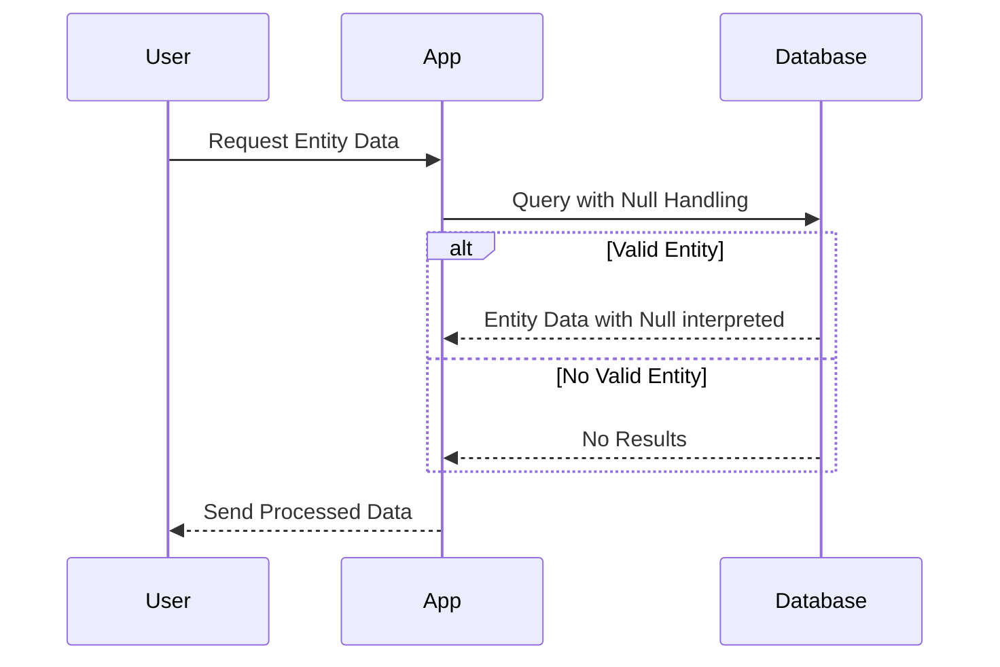

---

linkTitle: "Handling Null Temporal Values"
title: "Handling Null Temporal Values"
category: "Bitemporal Tables"
series: "Data Modeling Design Patterns"
description: "A design pattern to handle null temporal values effectively in bitemporal tables by defining how nulls are interpreted, such as treating null ValidTo as ongoing validity."
categories:
- Data Modeling
- Database Design
- Temporal Data
tags:
- Bitemporal
- Null Handling
- Data Integrity
- Temporal Columns
- SQL
date: 2024-07-07
type: docs

canonical: "https://softwarepatternslexicon.com/103/2/25"
license: "© 2024 Tokenizer Inc. CC BY-NC-SA 4.0"
---


## Description

The "Handling Null Temporal Values" design pattern addresses the need to interpret and manage null values specifically within temporal columns of bitemporal tables. Temporal data often records the validity and transaction time dimensions of entities. Handling null values correctly in such columns is crucial, as they impact data interpretation, storage efficiency, and querying logic.

In bitemporal data models, it is common to encounter columns like `ValidFrom`, `ValidTo`, `TransactionFrom`, and `TransactionTo`. A null value in these columns can carry special significance. For instance, a null `ValidTo` may imply that the record is still valid or continuous. Therefore, this pattern elucidates best practices for managing nulls in a coherent manner that aligns with business logic and application requirements.

## Architectural Approaches

### 1. Default Interpretation Approach

Decide a default interpretation for null values based on their logical role:
- **Null `ValidTo` As Open-Ended Validity**: Assume ongoing validity until explicitly closed or updated.
- **Null `TransactionTo` As Open-Ended Transaction Span**: Indicate that the transaction is in the active timeline and not yet superseded.

### 2. Explicit Replacement Strategy

Replace nulls explicitly with placeholder values that align with your system's logic:
- Use maximum date/time values (e.g., `9999-12-31`) to represent indefinite future `ValidTo` or `TransactionTo`.
- Define sentinel values that are outside normal operational temporal range to avoid confusion with real dates.

### 3. Automatic Management in Code

Incorporate checks and standardizations in application logic and SQL statements:
- Use conditional checks and case statements in SQL to replace nulls with meaningful default values during querying.
- Implement service layer logic in applications that interprets null temporal values according to designated business rules.

### 4. Versioning and Auditing

For systems with comprehensive auditing requirements, maintain historical records by leveraging NULL in `ValidTo` for active records and populate `TransactionTo` only when data is superseded.

## Example Code

Here's an example demonstrating how SQL might handle null `ValidTo` by interpreting it as the present time:

```sql
SELECT *
FROM entities
WHERE
  ValidFrom <= CURRENT_DATE
  AND (ValidTo IS NULL OR ValidTo > CURRENT_DATE);
```

## Diagrams

### UML Sequence Diagram for Null Handling



## Related Patterns

- **Temporal Consistency Pattern**: Ensures consistency over temporal data updates.
- **Versioned Data Pattern**: Manages multiple versions of data seamlessly with timestamps.
- **Derived Temporal Views**: Construct views that interpret temporal data for specific scenarios.

## Additional Resources

- [Temporal Data Patterns for SQL](https://example.com/temporal-data-patterns-sql)
- [Handling Temporal Information in Databases](https://example.com/handling-temporal-databases)
- [Advanced Temporal Models](https://example.com/advanced-temporal-models)

## Summary

The "Handling Null Temporal Values" design pattern is vital for effectively portraying and managing temporal data within bitemporal tables. It provides flexibility and interpretive power, significantly impacting data integrity and application behavior. Implement this pattern by choosing appropriate default interpretations, employing explicit sentinel values, and adopting consistent application logic, ultimately resulting in efficient and clear-handed temporal data management.
