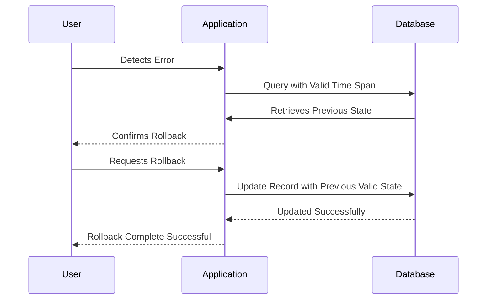

## Temporal Data Rollback Design Pattern

### Introduction
The Temporal Data Rollback pattern is utilized in systems that require the ability to restore data to any previous state based on temporal information. This pattern is particularly useful in systems like financial databases, where transaction errors can occur, and there is a need to revert changes to a prior correct state while maintaining accuracy and integrity.

### Design Pattern Explanation
Temporal Data Rollback leverages temporal or bitemporal data storage to track changes over time. Unlike traditional rollback methods that may require manual intervention or logs, this approach systematically records changes in data with timestamps. This allows automatic or semi-automatic restoration of the system's state to any valid past state.

### Architectural Approach
The implementation involves maintaining system and valid time dimensions within your database schema. Here's how it can typically be structured:

1. **System Time**: Captures when the record was physically valid in the database. Useful for storing historical data over the lifetime of its entry.
2. **Valid Time**: Captures the logical time period a fact is true in the real world.

An example schema for a bitemporal table might involve:

- **Record ID**: Unique identifier for each data entity.
- **Value**: The actual data state (e.g., account balance).
- **Valid Start/End Time**: When the data state was valid for the real-world object.
- **System Start/End Time**: Timestamps of when the data was entered and archived in the system.

### Example Implementation

For example, imagine a table named `AccountBalances` designed to store balance changes over time.

```sql
CREATE TABLE AccountBalances (
    record_id INT,
    account_id INT,
    balance DECIMAL(10, 2),
    valid_start DATETIME,
    valid_end DATETIME,
    system_start TIMESTAMP DEFAULT CURRENT_TIMESTAMP,
    system_end TIMESTAMP DEFAULT '9999-12-31 23:59:59'
);
```

#### Rollback Example
To rollback changes, suppose you detected an error in an account balance entered on a specific date. You can find and revert to the previous balance using:

```sql
SELECT record_id, balance FROM AccountBalances 
WHERE account_id = ? AND valid_start <= '2024-01-15' AND valid_end >= '2024-01-15' 
AND system_end = '9999-12-31 23:59:59'
ORDER BY valid_start DESC
LIMIT 1;
```
In this query, replace `'2024-01-15'` with the erroneous entry date.

### Diagrams

Below is a diagram demonstrating the rollback operation using Mermaid UML sequence diagram:



### Related Patterns
- **Event Sourcing**: Storing the state as a sequence of state-changing events, providing resilience and easy computation of rollback.
- **CQRS (Command Query Responsibility Segregation)**: Separating the read and write models to handle temporal data more efficiently.
  
### Additional Resources
- [Temporal Database Wikipedia](https://en.wikipedia.org/wiki/Temporal_database)
- [Martin Fowler: Temporal Patterns](https://martinfowler.com/articles/patterns-of-timedependencies.html)

### Summary
The Temporal Data Rollback pattern offers a robust approach to manage changes in volatile datasets, ensuring consistency and accuracy. This approach is essential for enterprise solutions, especially where data integrity over time can impact transactional processes and compliance.

In this pattern, by leveraging temporal databases, the rollback process becomes logical, less error-prone, and more aligned with system integrity standards for modern cloud systems.
