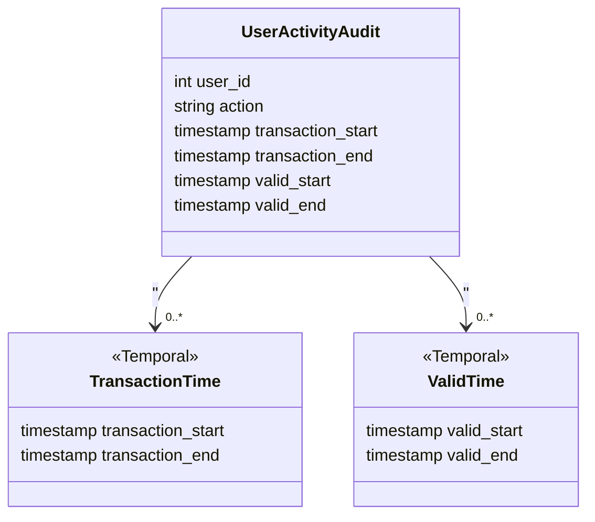

## Introduction

In today's data-driven world, capturing changes in data with comprehensive contextual information is critical for maintaining integrity, traceability, and accuracy. The Bi-Temporal Data Auditing pattern addresses this need by allowing for the audit of changes across two dimensions of time: transaction time and valid time.

## Pattern Overview

### Transaction Time
Transaction time represents the time when a record is stored in the database. It reflects when the data is entered into the system, providing a historical view of changes in the data storage.

### Valid Time
Valid time refers to the period during which the recorded fact is true in the modeled reality. This includes historical data, current records, and future changes anticipated by business logic or external factors.

The combination of these two temporal elements provides a robust mechanism for capturing data changes over time with a precise context.

### Use Cases
- **Auditing Systems**: Logging user actions and changes with a clear timeline for accountability.
- **Financial Systems**: Retaining detailed transaction records with both historical and planned changes.
- **Healthcare Systems**: Tracking medical records changes over time for compliance and historical accuracy.

## Architecture

Incorporating bi-temporal aspects into your database schema involves adding two time dimensions:

1. **Transaction Time Columns**
   - `transaction_start`: Records when the data entry was added to the system.
   - `transaction_end`: Marks when the data entry becomes invalid due to an update or deletion.

2. **Valid Time Columns**
   - `valid_start`: Denotes the beginning of the period when the data is considered accurate and applicable.
   - `valid_end`: Indicates when the data is no longer valid or relevant.

### Example Database Schema
```sql
CREATE TABLE user_activity_audit (
    user_id INT,
    action VARCHAR(255),
    transaction_start TIMESTAMP,
    transaction_end TIMESTAMP,
    valid_start TIMESTAMP,
    valid_end TIMESTAMP,
    PRIMARY KEY (user_id, transaction_start)
);
```

## Diagram



## Best Practices

- **Consistency**: Ensure consistent application of temporal properties across all relevant tables in your schema.
- **Optimization**: Index temporal fields for efficient querying and reporting.
- **Automation**: Use triggers or stored procedures to automatically manage transaction and valid time updates.
  
## Related Patterns

- **Slowly Changing Dimensions**: Focuses on tracking changes in dimensional data over time, which can be complemented by bi-temporal techniques.
- **Event Sourcing**: Captures every state change as a sequence of events, offering a natural alignment with bi-temporal data auditing.

## Additional Resources

- [Temporal Data & The Relational Model by C.J. Date](https://www.elsevier.com/books/temporal-data-and-the-relational-model/date/978-0-12-375041-9): A detailed guide on implementing temporal data models.

## Summary

The Bi-Temporal Data Auditing pattern allows for the meticulous recording of data changes along two time dimensions, providing a comprehensive and robust way to maintain historical accuracy and accountability in your systems. By understanding and employing this pattern, organizations can enhance their data integrity and auditing capabilities across various domains.
