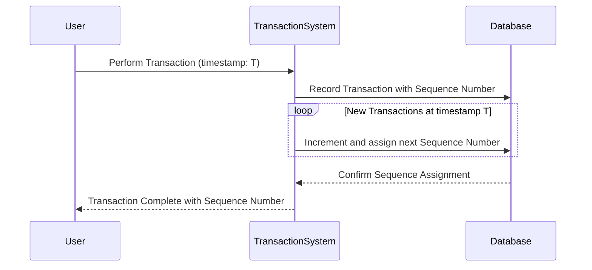

## Description

In systems that handle temporal data, it’s common to encounter events that share identical timestamps. This is especially prevalent in business applications where multiple transactions or changes can occur at practically the same moment. Temporal Sequence Numbers is a design pattern that introduces sequence numbers to differentiate and order these events, providing a clear and reliable way to process and query time-based data.

This pattern is highly useful in bitemporal systems, which track valid time (the time an event is effective in the real world) and transaction time (the time an event is recorded in the database). The addition of sequence numbers ensures that even within precise timepoints, the order of operations can be accurately maintained.

## Architectural Concepts

- **Temporal Sequence**: Assign a unique incrementing number to each event that occurs with the same timestamp to maintain order.
- **Bitemporal Data**: Use of sequence numbers alongside valid time and transaction time to address data versioning challenges.
- **Ordering and Consistency**: Provide guaranteed ordering for operations that logically occur at the same time.
- **Concurrency Control**: Helps in resolving conflicts by defining a clear sequence of events.

## Example Use Cases

- **Financial Transactions**: Ensure accurate ordering and reconciliation of simultaneous transactions on an account.
- **Log Management Systems**: Sorting logs that are timestamped down to the millisecond to maintain sequence of log messages.
- **Retail and Inventory Systems**: Ordering purchase and sale operations that are registered simultaneously.

## Example Code

Here is a simplified example using SQL to illustrate how temporal sequence numbers can be used to integrate with a table schema:

```sql
CREATE TABLE TransactionHistory (
    TransactionID SERIAL PRIMARY KEY,
    AccountID INT NOT NULL,
    TransactionAmount DECIMAL(10, 2) NOT NULL,
    ValidTime TIMESTAMP NOT NULL,
    TransactionTime TIMESTAMP DEFAULT CURRENT_TIMESTAMP,
    SequenceNumber INT,
    
    CONSTRAINT uc_Transaction UNIQUE (ValidTime, TransactionTime, SequenceNumber)
);

-- Inserting an example transaction with a sequence number
INSERT INTO TransactionHistory (AccountID, TransactionAmount, ValidTime, TransactionTime, SequenceNumber)
VALUES (123, 500.00, '2024-03-15 13:45:00', '2024-03-15 13:45:00', 1);
```

## Diagrams

Below is a Mermaid sequence diagram demonstrating the generation and use of sequence numbers within a transaction system:



## Related Patterns

- **Versioned Database Pattern**: Manages multiple versions of data records.
- **Event Sourcing**: Captures every change to the application state as a sequence of events.
- **Optimistic Concurrency Control**: Checks data versioning to handle concurrent transactions.

## Additional Resources

- [Temporal Tables in SQL Server and Best Practices](https://docs.microsoft.com/en-us/sql/relational-databases/tables/temporal-tables)
- [Bitemporal Modeling: Concepts and Best Practices](https://www.datarepublic.com/resources/what-are-bitemporal-tables/)
- [SQL Design Patterns for Temporal and Sequence Data](https://www.oreilly.com/library/view/sql-design-patterns/9781449317834/)

## Summary

Temporal Sequence Numbers are an essential tool in managing and ordering events with identical timestamps, especially in environments reliant on bitemporal data tracking systems. By utilizing this pattern, developers and data architects can maintain data consistency, resolve concurrency challenges, and provide accurate historical records within applications that track state changes down to precise moments. This leads to better-designed systems capable of addressing complex temporal data requirements.


