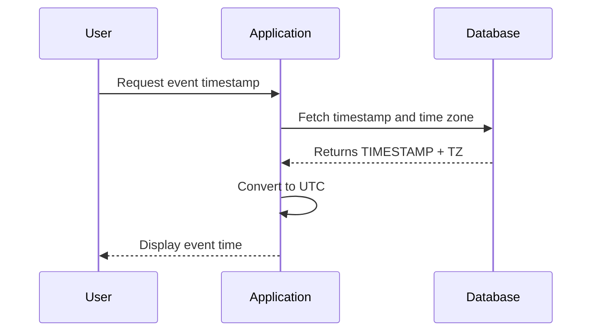

---

linkTitle: "Handling Time Zones in Temporal Data"
title: "Handling Time Zones in Temporal Data"
category: "Bitemporal Tables"
series: "Data Modeling Design Patterns"
description: "Learn how to effectively incorporate time zone information into temporal records within your data models to ensure accurate historical tracking and future forecasting."
categories:
- Data Modeling
- Temporal Data
- Bitemporal Tables
tags:
- Time Zone Handling
- Temporal Data
- Data Modeling
- Best Practices
- SQL
date: 2024-07-07
type: docs

canonical: "https://softwarepatternslexicon.com/103/2/30"
license: "© 2024 Tokenizer Inc. CC BY-NC-SA 4.0"
---


Incorporating time zone information into temporal data is crucial for applications dealing with historical data and future planning across multiple geographic locations. Proper handling of time zones ensures that the data remains consistent and interpretable regardless of where or when the data is accessed.

## Design Pattern Overview

Handling time zones in temporal data involves storing both the timestamp and time zone information, either as separate fields or combined in a complex data type. This allows for precise clock time and enables accurate conversion between time zones when the data is queried or displayed.

## Architectural Approach

### Separate Storage of Timestamp and Time Zone

One architectural approach involves storing the timestamp and time zone as separate columns:

```sql
CREATE TABLE GlobalEvent (
    EventID INT PRIMARY KEY,
    EventName VARCHAR(255),
    EventTimestamp TIMESTAMP,
    TimeZone VARCHAR(50)
);
```

This design allows flexibility in handling time zones, enabling conversions or calculations dependent on the stored time zone data.

### Zoned DateTime Support

Another approach is to use database systems that support a `ZonedDateTime` or equivalent data type, which embeds both timestamp and time zone data within a single field. This approach simplifies the handling of time and zone translations inherently:

```sql
CREATE TABLE GlobalEvent (
    EventID INT PRIMARY KEY,
    EventName VARCHAR(255),
    EventZonedDateTime TIMESTAMP WITH TIME ZONE
);
```

### Best Practices

- **Normalize Time Stamps**: Store timestamps in a standard format such as UTC and use the accompanying time zone to display localized times.
- **Handle Daylight Saving Changes**: Develop logic in your application to handle transitions like daylight saving time.
- **Use Standardized Time Zone Identifiers**: Prefer usage of ISO standard time zone identifiers (e.g., "America/New_York") to manage database records.

## Examples and Code Snippets

Here's a Java snippet demonstrating conversion using Java's `ZonedDateTime`:

```java
import java.time.ZonedDateTime;
import java.time.ZoneId;

ZonedDateTime eventDateTime = ZonedDateTime.now(ZoneId.of("Europe/London"));
System.out.println("Event LocalTime: " + eventDateTime);
ZonedDateTime utcDateTime = eventDateTime.withZoneSameInstant(ZoneId.of("UTC"));
System.out.println("Event Time in UTC: " + utcDateTime);
```

## Diagrams

Here's a simple sequence diagram illustrating the conversion of local time to UTC using a time zone:



## Related Patterns

- **Bitemporal Tables**: Useful when needing historical and row validity transactions simulated in a bi-temporal manner.
- **Audit Trails**: Often require temporal data with time zone detail for pinpoint tracking of changes within application contexts.

## Additional Resources

- [Java ZonedDateTime Documentation](https://docs.oracle.com/javase/8/docs/api/java/time/ZonedDateTime.html)
- [PostgreSQL: Working with Time Zones](https://www.postgresql.org/docs/current/datatype-datetime.html)

## Summary

Incorporating time zones into temporal data handling is crucial in today's global systems. Understanding various approaches — from separate storage fields to unified data types — empowers developers and architects to ensure accurate and consistent data management. By adhering to outlined best practices and utilizing related tools, applications can robustly handle time zone variances and changes, crucial for any temporal-rich domain.

---
