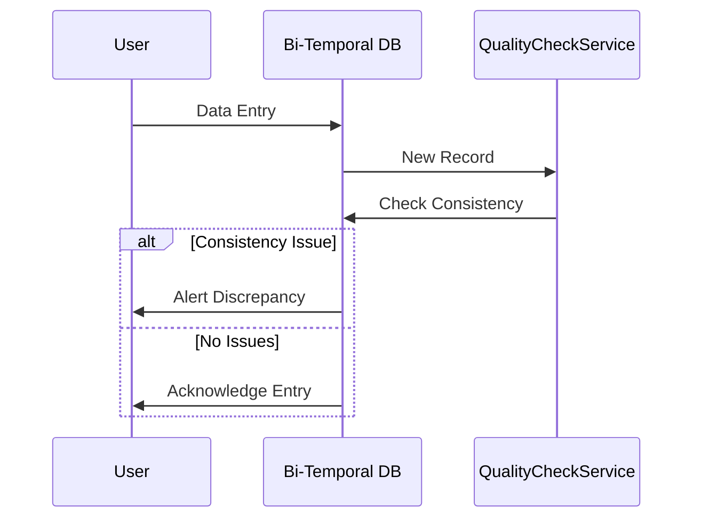

## Introduction

In the realm of data management, bi-temporal tables have become an essential aspect of capturing the historical and current states of data while accommodating two independent time axes: valid time and transaction time. Bi-temporal data models enable organizations to maintain comprehensive temporal data histories, which are crucial for accurate reporting, audit trails, and regulatory compliance. However, ensuring the integrity and quality of this data is a sophisticated challenge. A robust strategy involves implementing Bi-Temporal Data Quality Checks, a set of methodologies and practices designed to guarantee the precision and reliability of bi-temporal data.

## Design Pattern Overview

Bi-Temporal Data Quality Checks focus on validating two major concerns:

1. **Temporal Consistency**: Ensuring that the valid and transaction times are logically consistent. For example, no future transaction times should exist for records in the past.
2. **Data Integrity**: Maintaining accuracy in the records themselves, including checking for overlapping valid time intervals for the same entity and ensuring referential consistency.

### Example Code

Here's a conceptual example of a check using SQL to ensure no future transaction times are recorded in past data entries:

```sql
SELECT *
FROM bi_temporal_table
WHERE transaction_end_time < CURRENT_TIMESTAMP
AND transaction_start_time > transaction_end_time;
```

In this SQL query, we select records where the transaction end time is before the current timestamp and the transaction start time is anomalously after the transaction end time, which should never occur.

### Diagram Representation



This sequence diagram outlines the flow of a new record entry into the bi-temporal database, followed by a quality check to ensure data consistency. If inconsistencies are detected, the system alerts the user; otherwise, the entry process proceeds normally.

## Related Patterns

- **Event Sourcing**: This pattern can be combined with bi-temporal tables to reconstruct object states over time by capturing every change as an event.
- **Versioning**: Helps in maintaining different versions of data with temporal constraints.
- **Audit Logging**: Facilitates tracking changes over both valid and transaction times for regulatory compliance.

## Best Practices

- Regularly schedule batch processing to verify temporal data integrity using automated scripts.
- Implement alerting and reporting mechanisms to notify staff upon detection of temporal inconsistencies.
- Educate data input staff on the importance of entering precise valid and transaction times.
- Use effective indexing strategies to optimize the performance of data quality check operations.

## Additional Resources

- Martin Fowler's "Temporal Patterns" – A comprehensive resource for understanding different temporal modeling techniques.
- [Introduction to Bitemporal Modelling](https://www.dataversity.net) by Dataversity
- Time and Relational Theory by C. J. Date – A detailed exploration of temporal database concepts.

## Summary

Bi-Temporal Data Quality Checks serve as a critical component in maintaining the integrity and reliability of data within bi-temporal tables. By establishing stringent checks around temporal consistency and data integrity, organizations can ensure their data remains accurate and compliant with internal and external requirements. Implementing these checks not only enhances the fidelity of historical data but also optimizes decision-making processes by offering reliable, temporally-precise data perspectives.
