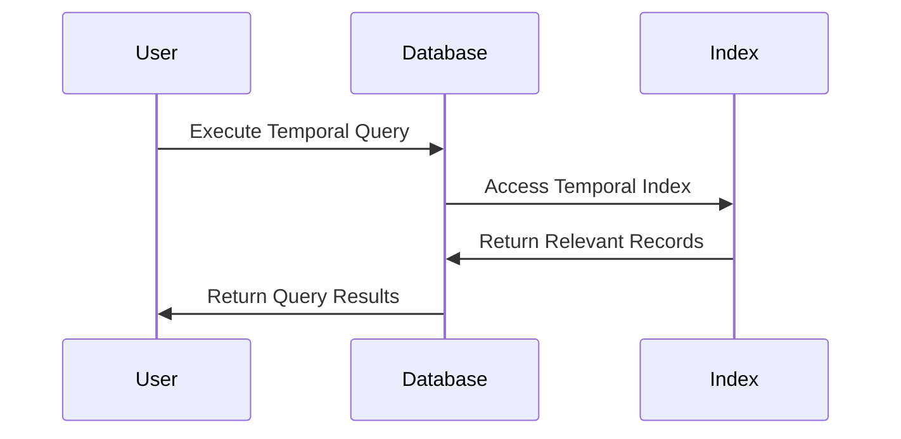

---

linkTitle: "Temporal Indexing"
title: "Temporal Indexing"
category: "Bitemporal Tables"
series: "Data Modeling Design Patterns"
description: "Creating temporal indexes in databases allows for efficient querying of temporal data, enhancing performance in accessing historical and versioned datasets."
categories:
- Data Modeling
- Database Design
- Query Optimization
tags:
- Temporal Indexing
- Bitemporal Tables
- Query Performance
- Database Indexing
- Data Efficiency
date: 2024-07-07
type: docs

canonical: "https://softwarepatternslexicon.com/103/2/5"
license: "© 2024 Tokenizer Inc. CC BY-NC-SA 4.0"
---

## Introduction

Temporal indexing is a crucial design pattern in databases where managing time-oriented data is necessary. By creating indexes on temporal columns such as `ValidFrom` and `ValidTo`, databases can perform time-based queries efficiently. This design pattern is particularly prevalent in systems utilizing bitemporal tables, where both valid time (business time) and transaction time need to be indexed for rapidly obtaining a historical view of data.

### Why Use Temporal Indexes?

Temporal indexes primarily enhance performance for:
- **Historical Data Retrieval**: Quickly accessing historical records within specific time ranges.
- **Temporal Joins**: Efficiently joining tables over temporal dimensions.
- **Versioned Data Management**: Accessing records based on versions over time.

## Architectural Approach

### Indexing Strategies

1. **Single Temporal Column Indexing**:  
   - **Index on Valid Time**: Creating an index on a single column like `ValidFrom` or `ValidTo`.
   - **Usage**: Useful for queries seeking records effective as of a specific or open-ended time.

2. **Compound Temporal Indexing**:  
   - **Combination Index on Valid Interval**: Creating compound indexes on both `ValidFrom` and `ValidTo` for effective temporal queries needing bounded time intervals.
   - **Usage**: Efficient for range queries and detecting overlapping or falling within certain periods.

### Implementation Considerations

- **Database Type**: Choose the appropriate indexing strategy based on the database capabilities (e.g., B-tree, Hash Indexes).
- **Temporal Data Volume**: Evaluate the size of temporal data and index overhead.
- **Index Maintenance**: Consider index updates with data changes.

## Example Code

**SQL Example**: Creating Temporal Indexes

```sql
-- Creating single column index
CREATE INDEX idx_valid_from ON temporal_table (ValidFrom);

-- Creating compound temporal index
CREATE INDEX idx_valid_period ON temporal_table (ValidFrom, ValidTo);
```

**Usage**: Fast queries for determining records valid during a time frame.

```sql
SELECT * FROM temporal_table 
WHERE ValidFrom <= '2024-01-01' AND ValidTo > '2024-01-01';
```

## Diagrams

### Temporal Index Utilization Sequence Diagram



## Best Practices

- **Periodic Review**: Regularly review and rebuild indexes for optimal indexing strategies.
- **Monitoring**: Continuously monitor the query performance and adjust indexing techniques accordingly.
- **Data Partitioning**: Consider partitioning large temporal datasets to enhance index efficiency.

## Related Patterns

1. **Event Sourcing**: Temporal indexes can efficiently support event sourcing, a design pattern capturing all changes as a sequence of events.
2. **Snapshot Pattern**: Utilize temporal indexes for efficient snapshot retrieval at specific time points.
3. **Audit Logging**: Leverage temporal tables for maintaining comprehensive audit trails.

## Additional Resources

- [Temporal Database Index Design](https://www.database-guide.com/temporal-indexing)
- [Efficient Time Interval Management with SQL](https://www.sql-bestpractices.com/time-interval-management)

## Summary

Temporal indexing, an essential pattern in the realm of databases, optimizes the handling of time-related data by enabling precise and fast queries over temporal ranges. Employing strategic indexing techniques plays a pivotal role in elevating database performance, especially in use cases demanding historical accuracy and versioning, ultimately culminating in a robust, efficient, and responsive data management system.

---

