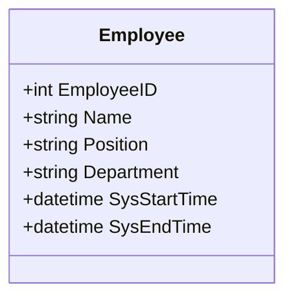

## Overview

System-versioned temporal tables are an advanced database design pattern that captures the full history of data changes automatically. By leveraging built-in database features, such as the system versioning available in SQL Server, organizations can maintain historical data without the complexity of additional application logic or manual entry.

## Detailed Explanation

### Key Concepts

- **System Versioning**: This feature allows the database to automatically manage and keep track of every row's validity period. Each row has two additional columns: one for the start time and another for the end time of its validity.
- **Transaction Time**: This refers to the time period during which a database row is considered valid from the perspective of the system operations rather than business events.

### Architectural Approach

In system-versioned temporal tables, the database itself manages historical data changes automatically. The basic structure includes:

1. **Current Table**: Stores the latest or "current" state of each row.
2. **History Table**: Stores previous states of the data with their respective start and end validity times.
3. **Period Columns**: `SysStartTime` and `SysEndTime` columns represent the versioning period for records.

### Implementation Example

Here is a basic example using SQL Server:

```sql
CREATE TABLE Employee
(
    EmployeeID INT PRIMARY KEY,
    Name NVARCHAR(100),
    Position NVARCHAR(100),
    Department NVARCHAR(100),
    SysStartTime DATETIME2 GENERATED ALWAYS AS ROW START NOT NULL,
    SysEndTime DATETIME2 GENERATED ALWAYS AS ROW END NOT NULL,
    PERIOD FOR SYSTEM_TIME (SysStartTime, SysEndTime)
) 
WITH (SYSTEM_VERSIONING = ON (HISTORY_TABLE = dbo.EmployeeHistory));
```

### Best Practices

1. **Schema Design**: Plan database schema carefully to ensure system-versioned tables reflect accurate real-world data operations.
2. **Policy Considerations**: Determine retention policies to manage the size of history tables.
3. **Access Patterns**: Optimize querying patterns for both current and historical data to balance performance and utility.

### Diagram



### Related Patterns

- **Application-Versioned Temporal Tables**: Where applications, rather than databases, handle the versioning and history tracking.
- **Bitemporal Tables**: Extend system-versioned tables by incorporating both transaction time and valid time for comprehensive temporal modeling.

### Additional Resources

- [Microsoft Docs on Temporal Tables](https://docs.microsoft.com/en-us/sql/relational-databases/tables/temporal-tables)
- [Temporal Data Management and Analytics](https://www.analyticsvidhya.com/blog/2020/09/temporal-data-basics/)

## Summary

System-versioned temporal tables simplify the implementation of historical data tracking by leveraging database-managed versioning features. This design pattern ensures data integrity and simplifies querying historical data while reducing the overhead associated with manual history table management. By thoughtfully applying these tables, organizations can achieve robust historical data management with minimal performance overhead and complexity.
