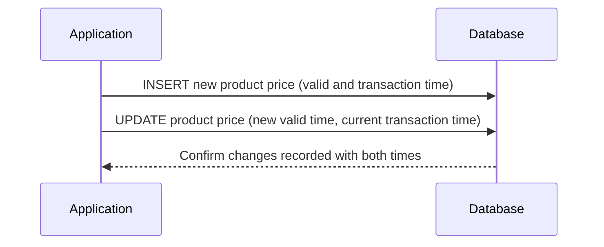

---

linkTitle: "History Tables with Bi-Temporal Data"
title: "History Tables with Bi-Temporal Data"
category: "Bitemporal Tables"
series: "Data Modeling Design Patterns"
description: "Maintaining history tables that track data changes over both valid and transaction times."
categories:
- data-modeling
- database-design
- bi-temporal
tags:
- history-tables
- temporal-data
- data-evolution
- transaction-time
- valid-time
date: 2024-07-07
type: docs

canonical: "https://softwarepatternslexicon.com/103/2/8"
license: "© 2024 Tokenizer Inc. CC BY-NC-SA 4.0"
---


In cloud computing and large-scale data warehouses, tracking data changes over time is crucial for analytics, auditing, compliance, and data lineage. One effective way to manage this is through History Tables with Bi-Temporal Data.

## Description

Bi-temporal tables allow you to record both the transaction time and valid time of data. This dual-dimensional approach is vital when organizations need insights on when data becomes valid and when it was recorded or modified in the system.

- **Valid Time**: Represents the time period when a fact is true in the real world.
- **Transaction Time**: Represents the time period when the data was stored in the database.

### Use Case

Consider a `ProductPriceHistory` table that tracks changes in the prices of products. It not only logs when the price was effective but also when the data was entered in the system, thus providing a comprehensive view for auditing and compliance.

## Architectural Approach

1. **Schema Design**
    - Design tables to include both valid time and transaction time columns.
    - Use indexing strategies to efficiently query based on temporal dimensions.

```sql
CREATE TABLE ProductPriceHistory (
    ProductID INT,
    Price DECIMAL(10, 2),
    ValidFrom DATE,
    ValidTo DATE,
    TransactionFrom TIMESTAMP,
    TransactionTo TIMESTAMP,
    PRIMARY KEY (ProductID, ValidFrom, TransactionFrom)
);
```

2. **Data Operations**
    - **Insertions**: Capture current transaction time upon new inserts.
    - **Updates**: Record the closing transaction time for modified records, insert a new record with updated data.
    - **Deletions**: Rarely done; usually achieved through logical deletion by closing transaction periods.

3. **Query Management**
    - When querying, one can filter records using both time dimensions to understand the data landscape at any point.

```sql
SELECT * FROM ProductPriceHistory
WHERE ValidTo > CURRENT_DATE AND TransactionTo > CURRENT_TIMESTAMP;
```

## Design Paradigms

- *Event Sourcing*: Keeps a sequential log of state changes.
- *Time-Travel Queries*: Allows revisiting past states and changes.
- *Slowly Changing Dimensions (SCD)*: Captures changes in data attributes over time in a data warehouse.

## Best Practices

- **Optimize Time Queries**: Index based on valid and transaction times to speed up access patterns.
- **Version Control**: Keep track of schema changes and data evolution, especially when complying with audit standards.
- **Storage Optimization**: Use efficient data storage strategies, such as partitioning based on time ranges.

## Diagrams

### Mermaid UML Sequence Diagram



## Related Patterns

- **Audit Trail**: A simpler version of retaining changes and decisions made over the data lifecycle.
- **Event Sourcing**: Keep a complete history of transactions in the form of events.

## Additional Resources

- [Temporal Database Design Patterns](https://example.com)
- [Managing Change in Bi-Temporal Data Models](https://example2.com)

## Summary

History Tables with Bi-Temporal Data are an essential design pattern in modern cloud computing strategies for managing, accessing, and understanding data change over time. This technique supports a wide array of analytical tasks, enhances data integrity, and simplifies auditing processes, all of which are critical in today's data-driven environments.

---
