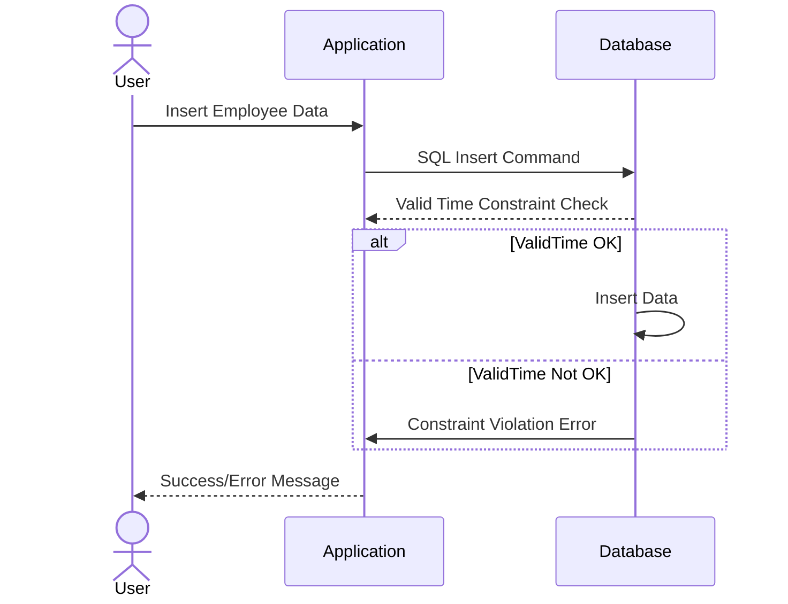

## Valid Time Constraints

In the context of data modeling, especially when dealing with bitemporal tables, valid time constraints play a critical role in maintaining data integrity. The concept involves ensuring that each record in the temporal database accurately represents the timeline from when a fact is true in the modeled reality.

### Description

Valid time constraints are implemented to ensure that the temporal columns `ValidFrom` and `ValidTo` adhere to a logical sequencing rule, explicitly ensuring that `ValidFrom` is always before `ValidTo`. This prevents temporal anomalies and inaccuracies in the historical representation of data.

### Architectural Approach

The approach to implementing valid time constraints can involve several components:

1. **Database Schema Constraints**: Leveraging SQL constraints such as `CHECK` constraints to ensure that for any given row, `ValidFrom < ValidTo`.
   
2. **Application Logic**: In conjunction with database-level constraints, application-level logic can be implemented to enforce these constraints before committing changes to the database.

3. **Automated Testing**: Implementing unit and integration tests to ensure the system correctly handles valid time constraints across various scenarios.

### Example Code

Below is an example of how you can enforce valid time constraints in an SQL database schema using a `CHECK` constraint to ensure `ValidFrom` is always less than `ValidTo`.

```sql
CREATE TABLE Employees (
    EmployeeID INT PRIMARY KEY,
    Name VARCHAR(100),
    ValidFrom DATE NOT NULL,
    ValidTo DATE NOT NULL,
    CONSTRAINT CK_ValidTime CHECK (ValidFrom < ValidTo)
);
```

### Diagrams

Below is a UML Sequence Diagram illustrating the sequence of operations for insertion check for valid time constraints:



### Related Patterns

- **System-Time Constraints**: Another temporal constraint focusing on system transaction times rather than the validity of the data itself.
- **Slowly Changing Dimensions**: A pattern used in data warehousing to manage changing data over time systematically.

### Best Practices

- **Consistency Checks**: Regularly run consistency checks within the database to detect any violations of valid time constraints or logical anomalies.
- **Comprehensive Testing**: Implement testing frameworks to simulate various valid and invalid scenarios to ensure robust handling of temporal data.
- **Error Notifications**: Implement real-time alerts or notifications for any detected violations in valid time constraints to promptly address issues.

### Additional Resources

- **Temporal Data & The Relational Model** by C.J. Date
- **Managing Time in Relational Databases** by Tom Johnston and Randall Weis

### Summary

Valid time constraints are essential for maintaining precise and reliable temporal data in bitemporal tables. By implementing these constraints at both the database and application level, organizations can ensure data integrity and accuracy over time, providing trustworthy historical data analysis and decision-making capabilities.

Understanding and applying valid time constraints contribute significantly to effective data modeling practices, especially in domains that require precise historical accuracy and robust temporal reasoning capabilities.
